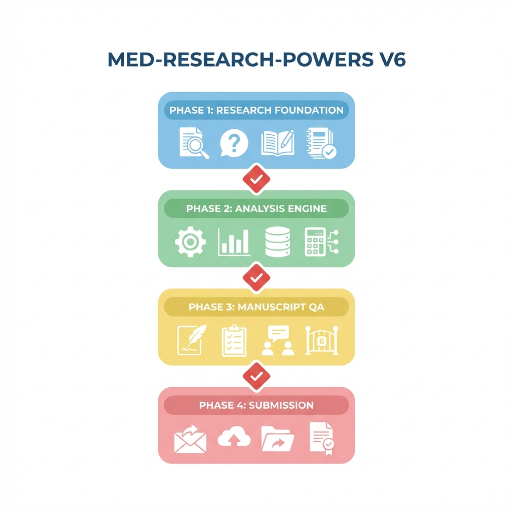
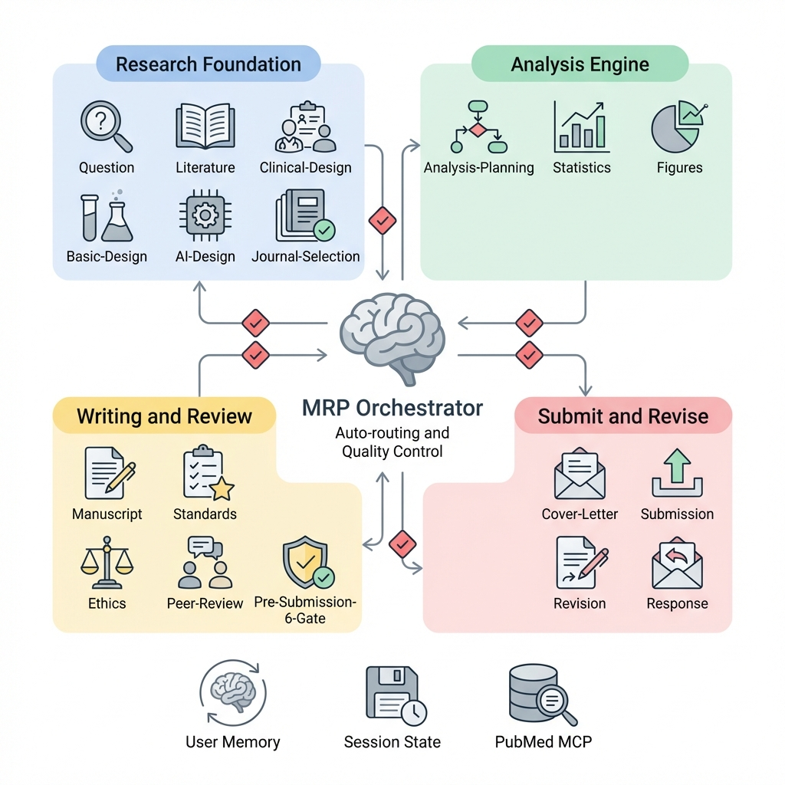
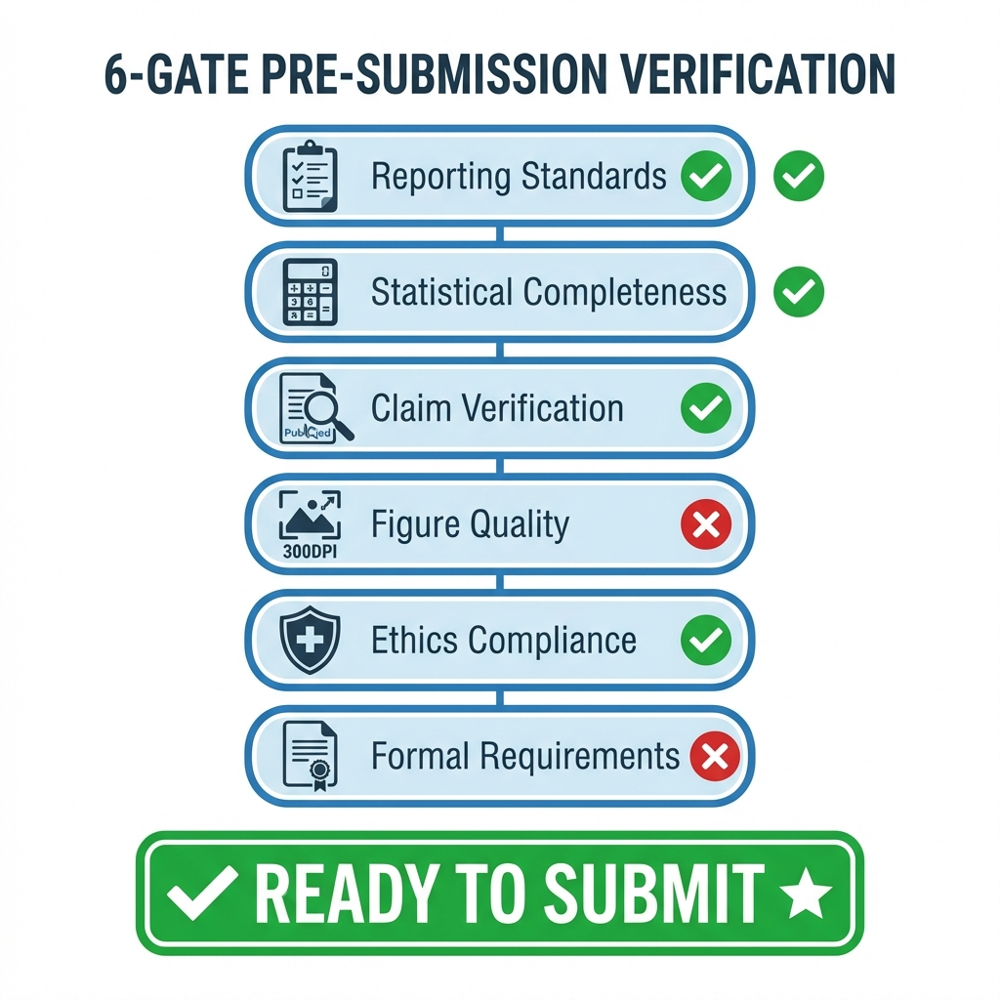
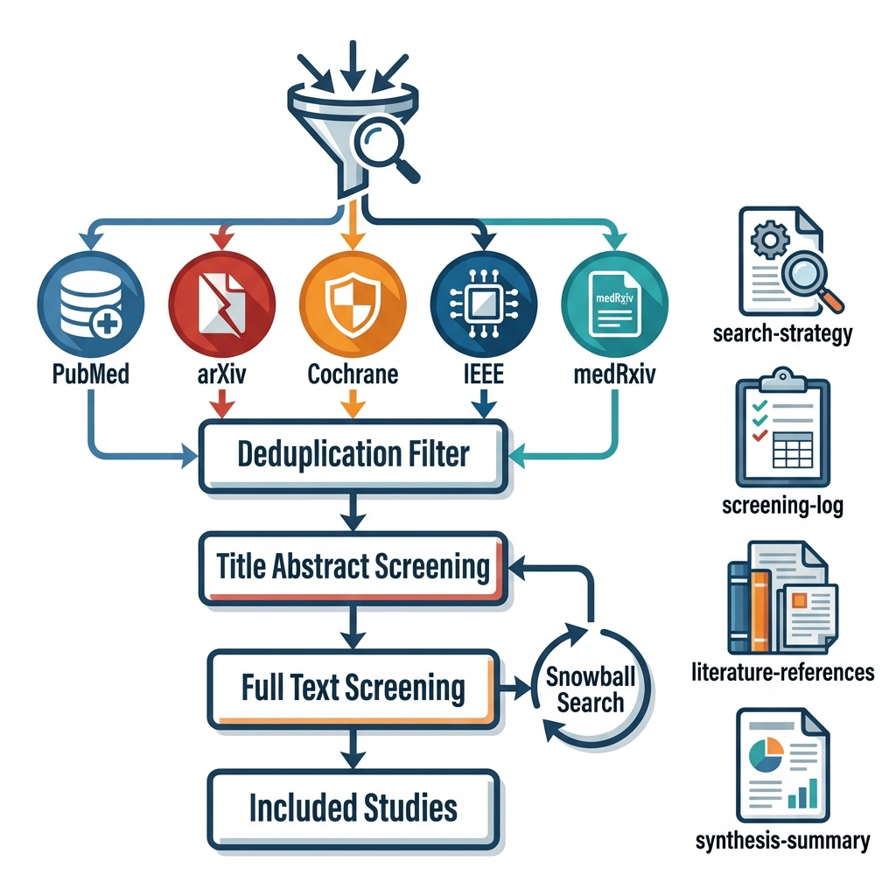

[English](README.md) | **中文**

# Med-Research-Powers

**从假设到发表 —— 一个由 AI 强制执行的研究方法学框架，在坏科学发生之前将其阻止。**

Med-Research-Powers (MRP) 是一个 [Claude Code](https://claude.ai/code) 插件，能够将 AI 编程助手转变为严谨的科研助手。MRP 不会让 AI 跳过文献综述、滥用统计方法、忽略报告规范或编造参考文献，而是强制执行一套包含硬性检查点、6 道预提交验证关卡和 4 位审稿人同行评审模拟的流水线 —— 确保每一篇离开你桌面的稿件都经得起审查。

灵感来源于 [Superpowers](https://github.com/obra/superpowers)（软件工程方法学框架），为临床及生物医学研究重新设计。

---

## 一览

| | |
|---|---|
| **技能** | 20 个技能，覆盖完整科研流程 |
| **斜杠命令** | 20 个命令，可直接调用 |
| **报告规范** | 约 42 项标准，包括 CONSORT 2025、STROBE、PRISMA、TRIPOD-AI、DECIDE-AI |
| **期刊模板** | 234 本期刊，横跨 30+ 个专科 |
| **统计方法** | 15+ 类方法，含决策树 |
| **Python 脚本** | 3 个内置脚本（假设检验、样本量计算、图表样式） |
| **预提交验证** | 6 道强制验证关卡，含 PubMed MCP 引用核查 |
| **同行评审** | 4 位审稿人模拟评审，0-100 量化评分 |
| **硬性检查点** | 4 个强制审批关卡，锁定关键决策 |
| **导出格式** | Markdown、.docx (python-docx)、.xlsx (openpyxl) |

---

## 为什么需要 MRP

AI 科研助手总是犯同样的错误：

| 没有 MRP | 使用 MRP |
|---|---|
| 直接跳到分析 | 先定义假设（PICO/FINER） |
| 选一个"看起来对的"统计检验 | 决策树根据已验证的假设条件选择检验方法 |
| 使用 CONSORT 2010 | 使用 CONSORT 2025（30 条目，已正式取代 2010 版） |
| 写完稿件，宣布"完成" | 6 道验证关卡阻止提交，直到全部合规 |
| 信心满满地编造参考文献 | PubMed MCP 自动验证每一条引用 |
| 只报告 p < 0.05，无效应量 | 要求报告效应量 + 95% CI + 精确 p 值 |
| 忽略报告规范 | 根据研究类型从约 42 项标准中匹配正确规范 |

**核心理念：强制执行的工作流，而非建议。**

1. **先定义，再设计** -- PICO/FINER 框架，没有假设就不做分析
2. **先计划，再执行** -- 统计分析计划（SAP）必须先于任何检验运行
3. **先验证，再提交** -- 6 道预提交检查，CONSORT 2025 合规性审核
4. **脚本优于提示词** -- 可复用的 Python 脚本，用于假设检验、样本量计算、图表样式

---

## 快速上手

### 作为 Claude Code 插件安装（推荐）

```bash
git clone https://github.com/Stefansong/med-research-powers
cd med-research-powers
```

在 Claude Code 中：
```
/plugin install ./med-research-powers
```

### 交互式安装器（备选方案）

```bash
git clone https://github.com/Stefansong/med-research-powers
cd med-research-powers
./install.sh
```

安装器会检测你的操作系统，提供三种安装方式（插件 / 复制 / 符号链接），并检查 Python 依赖。

### 验证安装

启动新的 Claude Code 会话，你应该能看到 MRP 自动发现消息。试试：

```
/mrp:research-question
```

或者直接说：*"我想设计一个关于 AI 辅助诊断的研究"* —— MRP 会自动路由到正确的技能。

### 第一个科研项目

```
你：  "我想研究 AI 能否提高 CT 上膀胱癌的检出率"

MRP:  使用 research-question-formulation 定义 PICO + 假设
      → literature-synthesis 检索 PubMed + arXiv
      → study-design 设计验证研究（Type C：AI/ML）
      → journal-selection 选择目标期刊
      → data-analysis-planning 制定 SAP
      → ...（完整流水线，每一步都有检查点）
```

---

## 流水线

### 架构概览



4 个硬性检查点锁定不可逆决策（Protocol、SAP、期刊、投稿前验证）。其余步骤遵循推荐顺序，但支持灵活推进和快速通道模式。反向链接允许在后续发现问题时返回上游技能。

### 流水线流程

```
research-question → literature-synthesis → study-design → journal-selection →
data-analysis-planning → data-collection-tools → [用户采集数据] →
statistical-analysis → figure-generation →
manuscript-writing → manuscript-export → pre-submission-verification →
submission-preparation → [提交] →
revision-response
```

**工具类技能**（可在任何阶段调用）：`pubmed-search`、`research-ethics`、`reporting-standards`

### 快速模式

适合有经验的用户：说 "go all the way" 或 "don't ask me" 即可跳过软性检查点。只有 4 个硬性检查点（方案、SAP、期刊、预提交）会暂停等待确认。

### 系统架构



元技能 `using-med-research-powers` 作为中央调度器，将任务路由到 5 个集群中的 20 个技能。基础设施组件（`session-start.sh` 钩子、`.mrp-state.json` 会话持久化、`.mrp-user-profile.json` 用户记忆、`plugin.json` 命令注册）和外部集成（PubMed MCP）构成外围环。

---

## 斜杠命令（20 个）

命令按流水线阶段分组。使用 `/mrp:<command>` 直接调用。

### 阶段 1 -- 研究基础

| 命令 | 用途 |
|---|---|
| `/mrp:research-question` | 使用 PICO/FINER 框架构建研究问题 |
| `/mrp:literature-synthesis` | 多数据库文献检索 + PRISMA 筛选 |
| `/mrp:study-design` | 统一研究设计入口：临床 / 基础 / AI-ML / 定性 / 问卷（内置类型路由） |
| `/mrp:journal-selection` | 目标期刊匹配，4 步评分 + 3 级排名 |

### 阶段 2 -- 分析与数据采集

| 命令 | 用途 |
|---|---|
| `/mrp:analyze-data` | 制定并执行统计分析，生成可复现脚本 |
| `/mrp:data-collection-tools` | 生成数据采集工具（推理脚本、CRF、标注模板） |
| `/mrp:figure-generation` | 生成出版级质量图表，含期刊专属配色 |

### 阶段 3 -- 稿件与质控

| 命令 | 用途 |
|---|---|
| `/mrp:write-manuscript` | 撰写稿件（原始研究 IMRaD 或综述），使用期刊模板 |
| `/mrp:manuscript-export` | 将 Markdown 稿件导出为 .docx，含期刊专属格式 |
| `/mrp:reporting-standards` | 根据研究类型匹配报告规范（约 42 项标准） |
| `/mrp:check-standards` | 组合命令：报告规范检查 + 6 道验证（投稿前快捷入口） |
| `/mrp:research-ethics` | 伦理合规：IRB、IACUC、知情同意、利益冲突 |
| `/mrp:peer-review` | 模拟 4 位审稿人的同行评审，含量化评分 |
| `/mrp:pre-submission` | 6 道强制预提交验证 |

### 阶段 4 -- 投稿与修回

| 命令 | 用途 |
|---|---|
| `/mrp:submission-preparation` | 撰写投稿信 + 投稿系统操作指南（ScholarOne、Editorial Manager） |
| `/mrp:revision-response` | 修回策略规划 + 逐条回复信 |

### 元命令

| 命令 | 用途 |
|---|---|
| `/mrp:using-mrp` | 元技能：路由、检查点、用户记忆、流水线状态 |
| `/mrp:pubmed-search` | 深度 PubMed 检索：交互式查询构建、引用验证、参考文献格式化 |
| `/mrp:team-collaboration` | 多智能体并行科研任务 |
| `/mrp:writing-mrp-skills` | 如何创建新的 MRP 技能 |

---

## 技能（20 个）

技能根据自然语言意图自动触发。你无需记住命令 —— 只需描述你的需求即可。

### 基础层（4 个技能）

| 技能 | 自动触发条件 | 输出 |
|---|---|---|
| `research-question-formulation` | "我想研究..."、研究思路、PICO | `research-question.md` |
| `literature-synthesis` | 文献综述、研究空白、背景 | 4 个文件：检索策略、筛选日志、参考文献、综合摘要 |
| `study-design` | 任何研究设计：临床 / 基础 / AI-ML / 定性 / 问卷 | `study-protocol.md` |
| `journal-selection` | 选哪个期刊、影响因子、期刊匹配 | `journal-selection-report.md` |

### 分析层（4 个技能）

| 技能 | 自动触发条件 | 输出 |
|---|---|---|
| `data-analysis-planning` | 分析策略、SAP、用什么检验 | `analysis-plan.md` |
| `data-collection-tools` | 生成脚本、CRF、标注模板 | `tools/` 目录，含脚本、模板、README |
| `statistical-analysis` | 跑分析、回归、生存分析 | 4 个文件：清洗日志、脚本、分析日志、结果摘要 |
| `figure-generation` | 图表、可视化 | 出版级 TIFF 文件 |

### 稿件层（6 个技能）

| 技能 | 自动触发条件 | 输出 |
|---|---|---|
| `manuscript-writing` | 写稿件、前言、方法、综述 | `manuscript/` 目录（IMRaD 或综述结构） |
| `manuscript-export` | 导出 Word、docx、格式化提交 | `manuscript.docx` 含期刊专属格式 |
| `reporting-standards` | CONSORT、STROBE、PRISMA、清单 | 匹配的清单及合规状态 |
| `research-ethics` | IRB、伦理、知情同意 | 伦理合规提醒 |
| `peer-review-simulation` | 审一下我的论文、审稿人会怎么说 | `peer-review-simulation-report.md` |
| `pre-submission-verification` | "完成了"、"可以投了"、定稿 | `submission-readiness-report.md` |

### 投稿层（2 个技能）

| 技能 | 自动触发条件 | 输出 |
|---|---|---|
| `submission-preparation` | 投稿信、cover letter、ScholarOne、怎么投稿 | `cover-letter.md` + `submission-checklist.md` |
| `revision-response` | 修回、大修/小修、审稿意见、回复审稿人 | `revision-plan.md` + `response-letter.md` |

### 工具层（1 个技能）

| 技能 | 自动触发条件 | 输出 |
|---|---|---|
| `pubmed-search` | PubMed 检索、验证引用、PMID、格式化参考文献 | 检索结果、验证报告、格式化参考文献 |

### 元层（3 个技能）

| 技能 | 自动触发条件 | 输出 |
|---|---|---|
| `using-med-research-powers` | 任何科研相关任务（调度器） | 路由 + 检查点管理 + 会话恢复 |
| `team-collaboration` | 并行、团队、同时执行多任务 | 协调的多智能体输出 |
| `writing-mrp-skills` | 创建新技能、修改技能 | 技能模板 |

### 研究类型路由

所有类型统一进入 `study-design`，内置类型路由器自动选择工作流：

```
研究类型？
+-- 临床试验 / 观察性研究 / 诊断研究   --> study-design（Type A）
+-- 基础实验 / 细胞 / 动物 / 分子      --> study-design（Type B）
+-- AI / ML / 影像 / LLM / VLM        --> study-design（Type C）
+-- 定性研究 / 访谈 / 扎根理论         --> study-design（Type D）
+-- 问卷调查 / 横断面调查              --> study-design（Type E）
```

---

## 硬性检查点

四个决策在真实研究中不可逆。MRP 将它们锁定在强制用户审批之后 —— 不允许静默通过，不允许默认确认。

| # | 检查点 | 触发时机 | 锁定内容 | 原因 |
|---|---|---|---|---|
| HC #1 | 方案审批 | `study-design` 之后 | 研究类型、主要结局 | 事后更改主要结局 = 结局切换 = 学术不端 |
| HC #2 | SAP 审批 | `data-analysis-planning` 之后 | 统计方法、分析计划 | 防止 p-hacking；所有偏离必须记录在案 |
| HC #3 | 期刊确认 | `journal-selection` 之后 | 目标期刊、格式规范 | 下游写作和排版依赖此选择 |
| HC #4 | 6 道验证 | `pre-submission-verification` 之后 | 投稿就绪状态 | 全部 6 道关卡必须通过方可投稿 |

---

## 检查点协议

每个技能完成后都会报告输出，然后才推进。不会静默跳转。

### 报告格式

每个技能完成后，MRP 输出结构化报告：

```
--------------------------------------
[技能名称] 已完成

生成文件：
  - [file1.md] -- [说明]
  - [file2.py] -- [说明]

关键发现：
  - [1-3 条关键发现或决策]

需要关注：
  - [需要用户判断的问题]

建议下一步：[下一个技能] -- [目的]
--------------------------------------
继续？还是修改当前输出？
```

### 确认规则

| 用户回复 | MRP 行为 |
|---|---|
| "继续" / "下一步" | 推进到建议的下一个技能 |
| "等等" / 要求修改 | 修改当前输出，重新报告 |
| "跳过 [技能]" | 记录原因，推进（pre-submission-verification 除外） |
| "回到 [技能]" | 回溯到指定技能 |

---

## 6 道预提交验证



当你说"完成了"或"可以投了"时自动触发。所有关卡必须通过。任何一道未通过都会阻止投稿，并路由回负责的技能。

### 关卡详情

| 关卡 | 检查内容 | 未通过处理 |
|---|---|---|
| **1. 报告规范** | 根据研究类型匹配正确标准；逐项检查（CONSORT 2025：30 条目）。要求 0 个严重错误。 | 返回 `manuscript-writing` |
| **2. 统计完整性** | 效应量 + 95% CI（不能只有 p 值）、精确 p 值、多重比较校正、敏感性分析、可复现脚本、SAP 偏离记录 | 返回 `statistical-analysis` |
| **3. 声明验证** | (A) 通过 PubMed MCP 验证参考文献真实性 -- 核实每个 PMID/DOI 是否存在。(B) 数据一致性 -- 摘要、结果、表格中的数字互相对应。(C) 声明-证据对齐。(D) 方法-结果匹配。(E) 预设分析 vs 探索性分析区分。(F) AI 幻觉检测。 | 修复参考文献 / 数据 |
| **4. 图表质量** | Arial/Helvetica 字体、最小 >=6pt、>=300 DPI（线条图 >=600）、坐标轴标签 + 单位、色盲友好配色、图注 | 返回 `figure-generation` |
| **5. 伦理合规** | 方法中注明 IRB 批准号、知情同意声明、利益冲突披露、资助来源、数据可用性声明、临床试验注册（如适用） | 返回 `research-ethics` |
| **6. 形式要求** | 字数在期刊限制内、摘要字数、参考文献数量、短标题 <=50 字符、3-6 个关键词、缩写首次出现时展开全称、作者信息完整 | 调整格式 |

---

## 4 位审稿人同行评审模拟


模拟真实的编辑流程，包含四位独立审稿人、量化评分和期刊级别校准预测。

### 审稿人组成

| 审稿人 | 角色 | 关注重点 |
|---|---|---|
| R1 -- 方法学家 | 研究设计专家 | 设计效度、统计方法、样本量、偏倚控制、可重复性 |
| R2 -- 临床专家 | 领域专家 | 临床意义、适用性、外部效度、替代解释 |
| R3 -- 学术编辑 | 期刊把关人 | 结构、语言质量、图表标准、参考文献完整性、期刊适配度 |
| R4 -- **魔鬼代言人** | 对抗性审稿人 | 挑战最强结论、发现盲点、提出最坏情况解读 |

魔鬼代言人不是搞破坏 —— 它帮你提前准备好真实审稿人会问的最刁钻问题。

### 8 维度评分（0-100）

| 维度 | 权重 | 刻度 |
|---|---|---|
| 原创性 | 15% | 0-30: 重复性 / 31-60: 增量性 / 61-80: 有意义 / 81-100: 突破性 |
| 方法学 | 20% | 0-30: 有缺陷 / 31-60: 可改进 / 61-80: 合理 / 81-100: 创新 |
| 结果 | 15% | 0-30: 不可靠 / 31-60: 部分可靠 / 61-80: 扎实 / 81-100: 有说服力 |
| 临床影响 | 15% | 0-30: 无 / 31-60: 有限 / 61-80: 有意义 / 81-100: 改变临床实践 |
| 写作质量 | 10% | 0-30: 不清晰 / 31-60: 需润色 / 61-80: 清晰 / 81-100: 优雅 |
| 图表 | 10% | 0-30: 不达标 / 31-60: 可接受 / 61-80: 专业 / 81-100: 出版级 |
| 参考文献 | 5% | 0-30: 不充分 / 31-60: 基本 / 61-80: 全面 / 81-100: 权威 |
| 可重复性 | 10% | 0-30: 不可重复 / 31-60: 部分可重复 / 61-80: 可重复 / 81-100: 完全透明 |

### 编辑总结与期刊校准

编辑总结不是简单的平均分。它遵循真实编辑行为：

- 如果任何审稿人标记了 **Critical** 问题，决定直接降为大修，无论分数多高
- 如果 >=2 位审稿人建议拒稿，决定为拒稿，无论平均分多高
- 分数根据目标期刊的层级进行校准：

| 期刊层级 | 校准方式 |
|---|---|
| 顶刊 (IF > 30): Nature, Lancet, JAMA | 分数调整 -10 至 -15 |
| 高分刊 (IF 10-30): 专科顶刊 | 分数调整 -5 至 -10 |
| 中等刊 (IF 5-10): 主流期刊 | 不调整 |
| 入门刊 (IF < 5): 入门级期刊 | 分数调整 +5 |

### 决策映射

| 校准后分数 | 预测结果 |
|---|---|
| 80-100 | 接收 / 小修 |
| 65-79 | 小修 |
| 50-64 | 大修 |
| < 50 | 拒稿 |

自动并行：4 位审稿人作为独立子智能体并行运行，然后由主智能体生成编辑总结。

---

## 多数据库文献检索



MRP 同时搜索多个数据库，以 PubMed MCP 作为主要检索引擎。

### PubMed MCP 功能

| 功能 | 用途 |
|---|---|
| `search_articles` | 关键词 / MeSH / 布尔检索 -- 主要检索引擎 |
| `get_article_metadata` | 获取完整元数据（作者、摘要、DOI），用于筛选 |
| `get_full_text_article` | 访问 PMC 全文，用于详细筛选和数据提取 |
| `find_related_articles` | 从种子文献出发的雪球检索 |
| `convert_article_ids` | PMID / PMCID / DOI 相互转换，确保参考文献一致性 |
| `lookup_article_by_citation` | 有引用信息但没有 PMID 时的反向查找 |
| `get_copyright_status` | 检查开放获取状态和再使用许可 |

### 按研究类型选择数据库

| 研究类型 | 主要数据库 | 补充数据库 |
|---|---|---|
| 临床 / 生物医学 | PubMed | Cochrane, Embase |
| AI/ML 医学 | PubMed + arXiv | IEEE Xplore, ACM DL |
| 系统综述 | PubMed + Cochrane + Embase | Web of Science |
| 基础 / 分子 | PubMed | bioRxiv, medRxiv |
| 手术视频 / 设备 | PubMed + IEEE | Scopus |

### 输出文件（4 个）

| 文件 | 内容 |
|---|---|
| `search-strategy.md` | 完整的可复现检索策略（按数据库） |
| `screening-log.md` | PRISMA 流程图数据，含每个阶段的计数 |
| `literature-references.md` | 每篇纳入研究的结构化记录 |
| `literature-synthesis-summary.md` | 证据图谱：已知 / 未知 / 有争议 + 研究空白 |

---

## 统计方法覆盖范围

决策树（`stat-method-decision-tree.yaml`）覆盖 15+ 类方法：

| 类别 | 方法 |
|---|---|
| **两组比较** | 独立/配对 t 检验、Welch's t 检验、Mann-Whitney U、Wilcoxon 符号秩检验、卡方检验、Fisher 精确检验 |
| **多组比较** | 单因素 ANOVA + Tukey、Welch's ANOVA + Games-Howell、Kruskal-Wallis + Dunn's、Friedman + Nemenyi、重复测量 ANOVA |
| **相关 / 回归** | Pearson、Spearman、线性回归、Logistic 回归、Poisson / 负二项回归 |
| **生存分析** | Log-rank、Kaplan-Meier、Cox 比例风险模型、竞争风险（Fine-Gray）、AFT 模型、时变协变量 |
| **纵向 / 混合模型** | 线性混合模型（LMM）、广义估计方程（GEE）、重复测量 ANOVA |
| **因果推断** | 倾向评分（匹配、IPTW、分层）、工具变量（2SLS）、双重差分 |
| **中介分析** | Baron-Kenny、因果中介（自然直接/间接效应）、Bootstrap 置信区间 |
| **缺失数据** | MCAR 检验（Little's test）、多重插补（MICE, m>=20）、MNAR 敏感性分析、临界点分析 |
| **聚类数据** | ICC 计算、设计效应、随机截距/斜率模型、聚类稳健 GEE |
| **交互 / 亚组** | 交互项、森林图、预设 vs 探索性标注 |
| **高维 / 组学** | PCA、UMAP/t-SNE、DESeq2、edgeR、limma、FDR 校正、批次效应去除（ComBat） |
| **间断时间序列** | 分段回归、ARIMA、对照 ITS |
| **多重比较** | Bonferroni、Holm、Benjamini-Hochberg FDR |
| **假设检验** | Shapiro-Wilk、D'Agostino-Pearson、Levene's、Mauchly 球形检验、Schoenfeld 残差 |

统计分析流水线共 6 步：加载 -> 清洗（缺失数据、异常值、类型验证）-> 假设检验 -> 执行分析 -> 样本量计算 -> 生成输出（4 个文件：`data-cleaning-log.md`、`analysis_script.py`、`analysis-log.md`、`results-summary.md`）。

---

## 期刊模板库

68 本期刊，横跨 22 个专科，每本都有完整的格式规范。

| 专科 | 期刊 |
|---|---|
| **综合顶刊** | Nature, Nature Medicine, Lancet, NEJM, JAMA, BMJ, Annals of Internal Medicine |
| **综合中等** | BMC Medicine, Medicine |
| **肿瘤学** | JCO, Lancet Oncology, JAMA Oncology, Annals of Oncology, Cancer Research |
| **外科学** | Annals of Surgery, JAMA Surgery, BJS, Surgical Endoscopy |
| **泌尿外科** | European Urology, Journal of Urology, BJU International |
| **心脏病学** | European Heart Journal, JACC, Circulation |
| **消化内科** | Gastroenterology, Gut, Hepatology |
| **呼吸内科** | Lancet Respiratory, AJRCCM, CHEST |
| **神经内科** | Lancet Neurology, Neurology, JAMA Neurology |
| **放射与影像** | Radiology, European Radiology, Medical Image Analysis |
| **AI / 数字健康** | npj Digital Medicine, Lancet Digital Health, JMIR, IEEE JBHI |
| **儿科** | Lancet Child, JAMA Pediatrics, Pediatrics |
| **骨科** | JBJS, CORR |
| **眼科** | Ophthalmology, JAMA Ophthalmology |
| **皮肤科** | JAMA Dermatology, BJD |
| **病理科** | Modern Pathology, AJSP |
| **感染病学** | Lancet ID, CID |
| **内分泌学** | Diabetes Care, Lancet Diabetes |
| **肾脏病学** | JASN |
| **精神科** | Lancet Psychiatry, JAMA Psychiatry |
| **系统综述** | Cochrane Database, Systematic Reviews |
| **开放获取** | PLOS Medicine, PLOS ONE, Nature Communications, Scientific Reports |
| **中国 SCI** | Chinese Medical Journal, Science Bulletin, Signal Transduction, eClinicalMedicine |

每个模板包含：字数限制、摘要格式（结构化/非结构化）、参考文献格式及上限、图表限制、章节结构、特殊要求（Key Points 框、Research in Context 面板、Reporting Summary）、投稿系统和 ORCID 政策。

**期刊家族模式：**
- **Lancet 家族**（10 个子刊）：全部要求 Research in Context 面板
- **JAMA 家族**（8 个子刊）：全部要求 Key Points 框
- **Nature 家族**（6 个子刊）：全部要求 Reporting Summary

如果目标期刊不在模板库中，MRP 会使用 WebSearch 检索 "Instructions for Authors" 并提取规范。

---

## 报告规范覆盖范围（约 42 项）

### 按研究类型分类

| 类别 | 标准 |
|---|---|
| **临床试验** | CONSORT 2025（30 条目）、CONSORT-AI、CONSORT-Cluster、SPIRIT 2025（34 条目）、SPIRIT-AI、TIDieR、CONSORT-Harms |
| **观察性研究** | STROBE（22 条目）、RECORD、STROCSS |
| **系统综述** | PRISMA 2020（27 条目）、PRISMA-P、PRISMA-ScR、PRISMA-S、PRISMA-DTA、PRISMA-NMA、TRIPOD-SRMA、AMSTAR 2、GRADE |
| **指南评估** | AGREE II（23 条目） |
| **观察性研究 Meta 分析** | MOOSE（35 条目） |
| **诊断准确性** | STARD 2015（30 条目） |
| **AI 与预测** | TRIPOD+AI 2024（27 条目）、TRIPOD-LLM、TRIPOD-Cluster、CLAIM（40 条目）、MI-CLAIM、DECIDE-AI（17 条目）、PROBAST |
| **外科与器械** | IDEAL 框架（5 阶段）、MVAL |
| **定性研究** | COREQ（32 条目）、SRQR（21 条目） |
| **临床前研究** | ARRIVE 2.0（21 条目） |
| **其他** | CARE（病例报告）、SQUIRE（质量改进）、CHEERS（卫生经济学） |
| **偏倚评估工具** | Cochrane RoB 2、ROBINS-I、NOS、MINORS、QUADAS-2 |

> **CONSORT 2010 已正式被取代。** MRP 使用 CONSORT 2025（30 条目）。[Hopewell et al., BMJ/JAMA/Lancet/Nature Medicine/PLOS Medicine, April 2025]

---

## Python 脚本

三个内置脚本为常见科研任务提供可复现的计算能力。

| 脚本 | 位置 | 用途 | 主要功能 |
|---|---|---|---|
| `assumption_tests.py` | `statistical-analysis/scripts/` | 统计假设检验 | 正态性（Shapiro-Wilk、D'Agostino-Pearson）、方差齐性（Levene's）、自动推荐检验方法、Cohen's d 含置信区间 |
| `power_analysis.py` | `statistical-analysis/scripts/` | 样本量计算 | 5 种研究设计：两组比较、比例、诊断准确性、生存、相关。含脱落率调整。 |
| `pub_style.py` | `figure-generation/scripts/` | 出版级 matplotlib 样式 | 期刊专属配色方案（Nature、Lancet、JAMA、NEJM）、色盲友好选项、Arial 字体、300+ DPI 导出 |

使用示例：

```python
# 假设检验
from assumption_tests import full_check
result = full_check(group1, group2, paired=False)
print(f"Recommended test: {result['recommended_test']}")

# 样本量计算
from power_analysis import two_groups
result = two_groups(effect_size=0.5, power=0.80, dropout=0.15)

# 出版图表样式
from pub_style import apply_style
apply_style('lancet')
```

---

## 多智能体并行协作

MRP 使用 Claude Code 的 Agent 工具并行化独立的科研任务，由主智能体协调结果。

### 自动并行（无需确认）

| 触发条件 | 并行任务 |
|---|---|
| 文献综述涉及 >=2 个数据库 | 每个数据库一个子智能体，同步检索 |
| 同行评审模拟 | 4 个子智能体作为独立审稿人，并行评估 |

### 需用户确认的并行

| 触发条件 | 并行任务 |
|---|---|
| 修回涉及多个独立的审稿意见 | 每位审稿人的反馈分配一个子智能体 |
| 方案设计需要多专家审查 | 统计学 + 方法学 + AI 专家智能体 |

### 合并规则

- 子智能体输出在合并前会检查数值一致性
- 对同一章节的冲突修改需要主智能体裁决
- 如果某个子智能体发现需要另一个智能体的数据，并行中止并切换为顺序执行

---

## 用户记忆系统

MRP 通过项目目录中的 `.mrp-user-profile.json` 跨会话记忆用户偏好。

### 记忆内容

| 类别 | 示例 |
|---|---|
| **个人信息** | 角色（PI / 博士生 / 博后）、科室、机构、经验水平 |
| **研究领域** | 泌尿外科、医学 AI、肿瘤学、流行病学 |
| **熟悉的方法** | RCT、队列、深度学习、生存分析 |
| **不熟悉的方法** | 贝叶斯、中介分析（触发额外解释） |
| **偏好期刊** | 记录每本期刊的投稿次数 |
| **工具偏好** | Python / R / SPSS / Stata、图表风格（Nature / Lancet / JAMA） |
| **历史记录** | 过去的项目、结果、常见审稿反馈模式 |

### 记忆的使用方式

| 技能 | 记忆用途 |
|---|---|
| `journal-selection` | 优先推荐以前投过的期刊 |
| `data-analysis-planning` | 用偏好语言（Python/R）生成脚本 |
| `figure-generation` | 应用偏好的图表风格 |
| `manuscript-writing` | 根据偏好期刊自动加载期刊模板 |
| `peer-review-simulation` | 聚焦历史上的薄弱环节 |
| `statistical-analysis` | 对不熟悉的方法提供额外解释 |

### 首次使用设置

首次使用（未找到 `.mrp-user-profile.json`）时，MRP 会问你 5 个快速问题：你的角色、研究领域、偏好期刊、熟悉的方法和分析工具。你可以回答或跳过。

### 隐私

- 记忆仅存储在本地 —— 不会上传到任何服务
- 随时删除 `.mrp-user-profile.json` 即可清除所有记忆
- 说 "forget my [字段]" 可以删除特定条目

---

## 会话状态管理

MRP 通过 `.mrp-state.json` 追踪研究进度，实现跨会话连续性。

```json
{
  "project": "Research title",
  "created": "2026-04-02",
  "current_stage": "data-analysis-planning",
  "target_journal": "European Urology",
  "completed_skills": [
    {"skill": "research-question-formulation", "output": "research-question.md", "date": "..."},
    {"skill": "study-design", "output": "study-protocol.md", "date": "..."}
  ],
  "artifacts": {
    "research-question.md": {"version": 1, "date": "..."},
    "analysis-plan.md": {"version": 2, "change_log": "Revised after lit review"}
  }
}
```

会话启动时，MRP 会检查 `.mrp-state.json` 并报告："上次完成：[阶段]。下一步：[技能]。继续吗？"

---

## .docx 和 .xlsx 导出

大多数期刊要求以 Word 格式提交。MRP 生成可直接投稿的导出文件。

| 文件 | 格式 | 用途 | 依赖 |
|---|---|---|---|
| `manuscript.docx` | Word | 主投稿文件（Times New Roman 12pt、双倍行距、2.54cm 页边距） | `python-docx` |
| `manuscript_tables.xlsx` | Excel | 单独上传的表格（基线、结局、亚组分别为不同工作表） | `openpyxl` |
| `title-page.docx` | Word | 单独的标题页（部分期刊要求） | `python-docx` |
| `supplementary.docx` | Word | 补充材料 | `python-docx` |
| `figures/*.tiff` | TIFF | 图片文件（由 `figure-generation` 生成） | `matplotlib` |

安装依赖：`pip install python-docx openpyxl`

---

## 架构对比：Superpowers vs MRP

MRP 将 Superpowers 方法学框架从软件工程适配到医学研究。

| Superpowers（软件工程） | Med-Research-Powers（医学研究） | 适配原因 |
|---|---|---|
| `brainstorming` | `research-question-formulation` | 结构化 PICO/FINER 替代自由发散 |
| `writing-plans` | `study-design` / `basic-study-design` / `ai-study-design` | 按研究领域拆分为三个专门的设计技能 |
| `test-driven-development` | `data-analysis-planning` | SAP = 测试计划；反 p-hacking = 反回归 |
| `executing-plans` | `statistical-analysis` | 可复现脚本 = 可复现构建 |
| `requesting-code-review` | `peer-review-simulation` | 4 位审稿人替代代码审查者 |
| `verification-before-completion` | `pre-submission-verification` | 6 道关卡系统替代 CI/CD 检查 |
| `receiving-code-review` | `responding-to-reviewers` | 逐条回复 = 代码审查回复 |
| `finishing-a-development-branch` | `journal-selection` + `cover-letter-writing` | 期刊定位替代合并/部署 |
| `writing-skills` | `writing-mrp-skills` | 相同的元技能，保证可扩展性 |
| -- | `literature-synthesis` | 软件工程中无对应物；研究需要证据综述 |
| -- | `reporting-standards` | 软件工程中无对应物；约 42 项领域特定合规标准 |
| -- | `research-ethics` | 软件工程中无对应物；IRB/IACUC 要求 |

---

## 项目结构

```
med-research-powers/
|-- .claude-plugin/
|   +-- plugin.json                    # 插件元数据 (v6.2.0, 20 个命令)
|-- hooks/
|   +-- session-start.sh              # 会话启动时自动注入路由表
|-- commands/                          # 20 个斜杠命令定义
|   +-- *.md
|-- skills/                            # 20 个技能定义
|   |-- */SKILL.md                     # 技能逻辑（触发条件、工作流、输出）
|   |-- */scripts/                     # 内置 Python 脚本
|   +-- */references/                  # 按需加载的参考数据 (YAML/MD)
|       |-- journal-templates.yaml     # 229 个期刊格式模板
|       |-- standards-index.yaml       # 约 42 项报告规范索引
|       |-- stat-method-decision-tree.yaml  # 统计方法选择决策树
|       |-- consort-2025.yaml          # 完整 30 条目 CONSORT 2025 清单
|       |-- metrics-and-reporting.yaml # AI 研究指标 + 报告映射
|       +-- experiment-templates/      # WB、qPCR、动物实验 (ARRIVE 2.0)
|-- docs/
|   +-- architecture.md               # Mermaid 架构图
|-- examples/
|   +-- showcase/                      # 真实流水线输出示例
|-- install.sh                         # 交互式安装器
|-- CONTRIBUTING.md
|-- CHANGELOG.md
+-- LICENSE (MIT)
```

---

## 适用研究类型

| 领域 | 研究类型 |
|---|---|
| **临床** | RCT（平行/交叉/非劣效/适应性/平台/实效性/N-of-1）、队列、病例对照、巢式病例对照、横断面、诊断准确性、真实世界研究、注册研究 |
| **AI/ML** | 医学影像 AI、手术视频 AI、LLM/VLM 评估、预测模型、临床 NLP、可穿戴/传感器 AI、数字疗法 |
| **基础科学** | 细胞生物学、动物模型、分子生物学、组织病理学、Western blot、qPCR、组织/器官培养 |
| **定性研究** | 访谈、焦点小组、扎根理论、现象学、民族志、主题分析、混合方法 |
| **问卷调查** | 横断面调查（KAP）、量表开发/验证、Delphi 共识、需求评估 |
| **证据综合** | 叙述性综述、系统综述、Meta 分析、网状 Meta 分析（NMA）、范围综述、微型综述 |
| **组学** | 代谢组学、蛋白质组学、基因组学、多组学整合 |
| **器械** | 智能器械、可穿戴设备、人因工程、传感器系统、IDEAL 框架分期 |
| **其他** | 医学教育、质量改进、病例报告、卫生经济学 |

---

## 案例展示

在 [`examples/showcase/`](examples/showcase/) 中查看真实的流水线产出 —— 包括在实际科研项目上运行 MRP 的完整输出，涵盖研究问题、分析计划、稿件、评审报告和投稿就绪检查。

*欢迎贡献 —— 在你的研究上运行流水线，然后提交 PR。*

---

## 参与贡献

详见 [CONTRIBUTING.md](CONTRIBUTING.md)。

**贡献方式：**

- **新技能** -- 阅读 `skills/writing-mrp-skills/SKILL.md` 编写指南，在 `skills/` 中创建技能，然后提交 PR
- **专科包** -- 为你的专科提供期刊配置、MeSH 词表、评估工具（放在 `packs/your-specialty/` 中）
- **报告规范** -- 在 `reporting-standards/references/checklists/` 中添加或更新清单
- **期刊模板** -- 按现有格式向 `journal-templates.yaml` 添加条目
- **Bug 报告** -- 提交 issue，说明哪些技能应该触发但没有触发、清单条目不正确或脚本错误

PR 描述应包含：该贡献解决什么问题、没有它时 Claude 会出什么错、有了它后如何改善。

---

## 许可证

[MIT](LICENSE)

---

## 致谢

- [Superpowers](https://github.com/obra/superpowers)，作者 Jesse Vincent -- 启发本项目的软件工程方法学框架
- [EQUATOR Network](https://www.equator-network.org/) -- 报告规范的权威来源
- [PubMed MCP](https://github.com/anthropics/claude-code) -- 实现自动化文献验证
