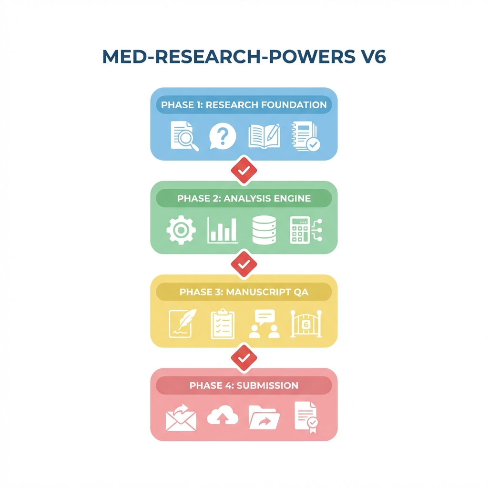

# Med-Research-Powers（医学科研方法论框架）

[English](README.md) | [中文](README_CN.md)

**从假设到发表 —— 一个由 AI 强制执行的科研方法论框架，在错误发生之前就把它挡住。**

Med-Research-Powers（MRP）是一个 [Claude Code](https://claude.ai/code) 插件，把 AI 智能体变成严谨的科研助手。它不让 AI 跳过文献综述、滥用统计、忽视报告规范或编造参考文献，而是用一条带硬检查点的科研主线、6 道投稿前关卡、4 位审稿人模拟来强制约束——让你交出去的每一篇稿件都经得起审查。

灵感来自 [Superpowers](https://github.com/obra/superpowers)（软件工程方法论），针对临床与生物医学研究做了改造。

> **版本 6.2.3** · 20 个 skill · 20 个斜杠命令 · MIT 许可 · 作者 BTCH Uro AI Lab

---

## 一览

| | |
|---|---|
| **Skills** | 20 个 skill，覆盖完整科研流程 |
| **斜杠命令** | 20 个命令，可直接调用 |
| **研究类型** | 临床、基础/实验、AI/ML、定性、问卷/Delphi（统一入口路由） |
| **报告规范** | 41 项 —— CONSORT 2025、SPIRIT 2025、STROBE、PRISMA、TRIPOD+AI 2024、DECIDE-AI、CLAIM、IDEAL、ARRIVE 2.0、COREQ、CHERRIES …… |
| **期刊模板** | 234 本期刊，覆盖 30+ 专科 |
| **统计方法** | 15+ 类方法，配前提假设驱动的决策树 |
| **Python 脚本** | 5 个内置脚本（前提检验、效能分析、分析脚手架、绘图样式、.docx 导出） |
| **投稿前检查** | 6 道强制关卡，含 PubMed MCP 引用核验 |
| **同行评审** | 4 位审稿人模拟，0–100 量化评分，覆盖 8 个维度 |
| **硬检查点** | 4 个锁定不可逆决策的确认关卡 |
| **导出格式** | Markdown、`.docx`（python-docx）、`.xlsx`（openpyxl） |

---

## 为什么需要 MRP

AI 科研智能体每次都会犯同样的错。MRP 用强制流程取代“凭感觉”：

| 没有 MRP | 有 MRP |
|---|---|
| 直接开跑分析 | 先定义假设（PICO / FINER） |
| 挑一个“看起来对”的统计检验 | 决策树基于**已验证**的前提假设选方法 |
| 用 CONSORT 2010 | 用 CONSORT 2025（31 个编号条目 / 含子项共 34 行；已正式取代 2010） |
| 写完稿子就说“完成” | 6 道关卡不合规就不让投 |
| 自信地编造参考文献 | PubMed MCP 自动核验每一条引用 |
| 只报 `p < 0.05`，没有效应量 | 必须给效应量 + 95% CI + 精确 p 值 |
| 忽视报告规范 | 从 41 项里匹配研究类型对应的规范 |
| AI 数据随机划分 | 患者级划分，提示数据泄漏与外部验证 |

**核心理念 —— 强制流程，而非建议：**

1. **先定义，再设计** —— PICO/FINER，没有假设不做分析。
2. **先计划，再执行** —— 任何检验前先有统计分析计划（SAP）。
3. **先核验，再投稿** —— 6 道投稿前关卡；CONSORT 2025 合规。
4. **脚本优于提示** —— 前提检验、样本量、绘图、导出都用可复用 Python。

---

## 快速开始

### 作为 Claude Code 插件安装（推荐）

```bash
git clone https://github.com/Stefansong/med-research-powers
cd med-research-powers
```

在 Claude Code 中：

```
/plugin install ./med-research-powers
```

只有插件方式会同时启用 session-start hook（自动发现 + 路由）。

### 交互式安装脚本（备选）

```bash
git clone https://github.com/Stefansong/med-research-powers
cd med-research-powers
./install.sh
```

脚本会检测平台、提供三种方式（插件 / 复制 / 软链接）并检查 Python 依赖。注意：复制和软链接方式只安装 skill，**不会**启用 session hook。

### 验证

新开一个 Claude Code 会话，试试：

```
/mrp:research-question
```

或者直接说 *“我想做一个 AI 辅助诊断的研究”* —— MRP 会自动路由到对应 skill。

### 第一个项目

```
你：  “我想研究 AI 能不能提升 CT 上膀胱癌的检出”

MRP： 用 research-question-formulation 定义 PICO + 假设
      → literature-synthesis 检索 PubMed + 预印本
      → study-design（Type C：AI/ML）设计验证研究
      → journal-selection 选目标期刊
      → data-analysis-planning 撰写 SAP
      → …（完整主线，每步后都有检查点）
```

---

## 研究主线（Pipeline）



```
research-question-formulation → literature-synthesis → study-design → journal-selection →
data-analysis-planning → data-collection-tools → [你收集数据] →
statistical-analysis → figure-generation →
manuscript-writing → manuscript-export → peer-review-simulation → pre-submission-verification →
submission-preparation → [投稿] → revision-response
```

- **`study-design`** 是统一入口路由，覆盖 Type A（临床）、B（基础/实验）、C（AI/ML）、D（定性）、E（问卷/Delphi）。
- **`submission-preparation`** 负责投稿信撰写 + 投稿系统指南。
- **`revision-response`** 负责修稿策略 + 逐条回复审稿意见。
- 辅助 skill（`pubmed-search`、`data-collection-tools`、`manuscript-export`、`team-collaboration`）随时可调用。

### 硬检查点（不可跳过）

以下 4 个决策在真实研究中不可逆，MRP 把它们锁定在**明确**确认之后——“无响应”绝不视为通过：

| # | 检查点 | 触发时机 | 锁定内容 | 为何重要 |
|---|---|---|---|---|
| HC #1 | **`study-protocol.md`** | `study-design` 之后 | 研究类型、主要结局 | 事后改主要结局 = outcome switching = 学术不端 |
| HC #2 | **`analysis-plan.md`（SAP）** | `data-analysis-planning` 之后 | 统计方法、分析策略 | 防 p-hacking 的核心机制；所有偏离必须记录 |
| HC #3 | **`journal-selection-report.md`** | `journal-selection` 之后 | 目标期刊、格式规格 | 下游写作与排版依赖此选择 |
| HC #4 | **`submission-readiness-report.md`** | `pre-submission-verification` 之后 | 投稿就绪状态 | 6 道关卡全部通过才能投稿 |

### 快速模式与回溯

- **Fast-Track 快速模式** —— 当你说“一直做到最后 / 不用问我”，MRP 只在 4 个硬检查点暂停，软步骤自动推进。
- **回溯链接** —— 在下游发现问题（如投稿前检查时报告规范不合规）可回到上游 skill，修改后的产物会被重新验证。

---

## 20 个 Skill

Skill 根据自然语言意图自动触发——你无需记住命令。它们分为六层。

### 基础层（Foundation）

| # | Skill | 何时使用 | 输出 |
|---|-------|---------|------|
| 1 | **research-question-formulation** | 模糊想法需要明确的问题 + 假设（PICO/PIRD/FINER）。 | `research-question.md` |
| 2 | **literature-synthesis** | 系统检索与综述文献、寻找 research gap（PRISMA 流程）。 | 4 个文件：检索策略、筛选日志、参考文献、综合摘要 |
| 3 | **study-design** | 设计任意研究方案——临床/基础/AI-ML/定性/问卷（Type A–E 路由）。 | `study-protocol.md` |
| 4 | **journal-selection** | 选目标期刊（评分匹配 + 三梯队级联策略）。 | `journal-selection-report.md` |

### 分析层（Analysis）

| # | Skill | 何时使用 | 输出 |
|---|-------|---------|------|
| 5 | **data-analysis-planning** | 在任何检验**之前**撰写 SAP（statistical-analysis 的前置）。 | `analysis-plan.md` |
| 6 | **data-collection-tools** | 根据 protocol 生成 CRF、标注表、REDCap 表、推理/评估脚本。 | `tools/` 目录（脚本、模板、README） |
| 7 | **statistical-analysis** | 在真实数据上执行分析（需先完成 SAP）。 | 4 个文件：清洗日志、脚本、分析日志、结果摘要 |
| 8 | **figure-generation** | 出版级图表（期刊样式、≥300 DPI、色盲友好）。 | 出版级 TIFF 文件 |

### 稿件层（Manuscript）

| # | Skill | 何时使用 | 输出 |
|---|-------|---------|------|
| 9 | **manuscript-writing** | 撰写原始研究或综述（5 种综述类型）。 | `manuscript/` 目录（IMRaD 或综述结构） |
| 10 | **manuscript-export** | 把 Markdown 导出为符合期刊排版的 `.docx`。 | `manuscript.docx` |
| 11 | **reporting-standards** | 把研究类型匹配到正确规范并检查合规。 | 匹配清单 + 合规状态 |
| 12 | **peer-review-simulation** | 投稿前模拟同行评审（4 审稿人 + 8 维度 0–100 评分）。 | `peer-review-simulation-report.md` |
| 13 | **research-ethics** | 检查 IRB/IACUC、知情同意、隐私、注册、COI；起草伦理声明。 | 伦理合规声明 |
| 14 | **pre-submission-verification** | **强制** 6 道关卡终检——全部通过才能投。 | `submission-readiness-report.md` |

### 投稿层（Submission）

| # | Skill | 何时使用 | 输出 |
|---|-------|---------|------|
| 15 | **submission-preparation** | 写投稿信 + 投稿系统指南（ScholarOne / Editorial Manager）。 | `cover-letter.md` + `submission-checklist.md` |
| 16 | **revision-response** | 制定修稿策略 + 起草逐条回复信（rebuttal）。 | `revision-plan.md` + `response-letter.md` |

### 工具层（Utility）

| # | Skill | 何时使用 | 输出 |
|---|-------|---------|------|
| 17 | **pubmed-search** | 用 PubMed MCP 检索、核验引用、批量取元数据。 | 检索结果、核验报告、格式化参考文献 |

### 元层（Meta）

| # | Skill | 何时使用 | 输出 |
|---|-------|---------|------|
| 18 | **team-collaboration** | 项目适合多 agent 并行（通过 Task 工具派发）。 | 协调的多 agent 输出 |
| 19 | **using-med-research-powers** | 编排器——路由、检查点、流程状态、用户记忆。 | 路由 + 检查点管理 + 会话恢复 |
| 20 | **writing-mrp-skills** | 创建、测试、改进 MRP skill。 | Skill 模板 |

---

## 20 个斜杠命令

每个 skill 都可用自然语言触发；命令提供直接入口。用 `/mrp:<命令>` 直接调用。命令按流水线阶段分组。

### 阶段 1 —— 研究基础

| 命令 | 作用 |
|------|------|
| `/mrp:research-question` | 把模糊想法变成 PICO 问题 + 假设 |
| `/mrp:literature-synthesis` | 多数据库文献检索与综述（PRISMA + gap map） |
| `/mrp:study-design` | 为任意研究类型设计方案（临床/基础/AI/定性/问卷） |
| `/mrp:journal-selection` | 选最合适的目标期刊（评分匹配 + 三梯队级联） |

### 阶段 2 —— 分析与数据采集

| 命令 | 作用 |
|------|------|
| `/mrp:analyze-data` | 先计划**再**执行统计分析（计划 → 执行） |
| `/mrp:data-collection-tools` | 根据 protocol 生成 CRF、标注表与脚本 |
| `/mrp:figure-generation` | 出版级图表（期刊样式、≥300 DPI、色盲友好） |

### 阶段 3 —— 稿件与质控

| 命令 | 作用 |
|------|------|
| `/mrp:write-manuscript` | 撰写医学研究稿件（IMRaD 或综述） |
| `/mrp:manuscript-export` | Markdown → 符合期刊排版的 `.docx` |
| `/mrp:reporting-standards` | 把研究类型匹配到报告规范（41 项） |
| `/mrp:check-standards` | 报告规范合规检查（投稿前检查的 Gate 1） |
| `/mrp:research-ethics` | 检查伦理合规并起草伦理声明 |
| `/mrp:peer-review` | 模拟同行评审（4 审稿人 + 8 维度评分） |
| `/mrp:pre-submission` | **强制** 6 道投稿前关卡核验 |

### 阶段 4 —— 投稿与修回

| 命令 | 作用 |
|------|------|
| `/mrp:submission-preparation` | 写投稿信 + 投稿系统指南 |
| `/mrp:revision-response` | 制定修稿策略 + 起草逐条回复 |

### 元命令与工具

| 命令 | 作用 |
|------|------|
| `/mrp:pubmed-search` | 检索 PubMed / 核验引用 / 取元数据 |
| `/mrp:team-collaboration` | 运行多 agent 并行科研任务 |
| `/mrp:using-mrp` | 编排器——路由规则、流程与检查点 |
| `/mrp:writing-mrp-skills` | 创建、测试、改进 MRP skill |

---

## 检查点协议

每个 skill 完成后都会报告输出，然后才推进——不会静默跳转。

### 报告格式

每个 skill 完成后，MRP 输出结构化报告：

```
--------------------------------------
[Skill 名称] 已完成

生成文件：
  - [file1.md] -- [说明]
  - [file2.py] -- [说明]

关键发现：
  - [1-3 条关键发现或决策]

需要关注：
  - [需要用户判断的问题]

建议下一步：[下一个 skill] -- [目的]
--------------------------------------
继续？还是修改当前输出？
```

### 确认规则

| 用户回复 | MRP 行为 |
|---------|---------|
| “继续” / “下一步” | 推进到建议的下一个 skill |
| “等等” / 要求修改 | 修改当前输出，重新报告 |
| “跳过 [skill]” | 记录原因，推进（`pre-submission-verification` 除外） |
| “回到 [skill]” | 回溯到指定 skill；修改后的产物会被重新验证 |

硬检查点绝不自动通过：“无响应”绝不视为确认。

---

## 研究设计路由（Type A–E）

`study-design` 是单一入口，自动路由到对应方法学与报告规范：

| 类型 | 领域 | 示例 | 主要规范 |
|------|------|------|---------|
| **A** | 临床 | RCT、队列、横断面、交叉、非劣效、适应性、真实世界、注册研究 | CONSORT 2025 / SPIRIT 2025 / STROBE |
| **B** | 基础 / 实验 | 细胞、动物、分子（WB、qPCR、ELISA、流式、IF） | ARRIVE 2.0 |
| **C** | AI / ML | 影像、视频、LLM、器械 | TRIPOD+AI 2024 / DECIDE-AI / CLAIM / IDEAL |
| **D** | 定性 | 访谈、焦点小组、扎根理论、混合方法 | COREQ / SRQR |
| **E** | 问卷 / Delphi | 问卷、量表开发/验证、共识研究 | CHERRIES |

多类型研究可叠加相应模块。AI/ML 模块强制患者级数据划分、4 档样本量策略、类别不平衡处理与决策曲线分析（DCA）。

`manuscript-writing` 同样支持原始研究**以及** 5 种综述：叙述性、系统、meta 分析、scoping、mini-review。

---

## 6 道投稿前核验

当你说“完成了”或“可以投了”时，`pre-submission-verification` 自动触发。它是强制环节，任一关卡不过就不让投稿，任何失败都会路由回负责的 skill。

| 关卡 | 检查内容 | 未通过处理 |
|---|---|---|
| **1. 报告规范** | 根据研究类型匹配正确标准；逐项检查（CONSORT 2025：31 个编号条目 / 34 行）。要求 0 个 Critical 错误。 | 返回 `manuscript-writing` |
| **2. 统计完整性** | 效应量 + 95% CI（不能只有 p 值）、精确 p 值、多重比较校正、敏感性分析、可复现脚本、SAP 偏离记录 | 返回 `statistical-analysis` |
| **3. 声明核验** | (A) 通过 PubMed MCP 核验参考文献真实性——核实每个 PMID/DOI 是否存在。(B) 数据一致性——摘要、结果、表格中的数字互相对应。(C) 声明-证据对齐。(D) 方法-结果匹配。(E) 预设分析 vs 探索性分析区分。(F) AI 幻觉检测。 | 修复参考文献 / 数据 |
| **4. 图表质量** | Arial/Helvetica 字体、最小 ≥6pt、≥300 DPI（线条图 ≥600）、坐标轴标签 + 单位、色盲友好配色、图注 | 返回 `figure-generation` |
| **5. 伦理与合规** | 方法中注明 IRB 批准号、知情同意声明、利益冲突披露、资助来源、数据可用性声明、临床试验注册（如适用） | 返回 `research-ethics` |
| **6. 形式要求** | 字数在期刊限制内、摘要字数、参考文献数量、短标题 ≤50 字符、3–6 个关键词、缩写首次出现时展开全称、作者信息完整 | 调整格式 |

---

## 4 位审稿人同行评审模拟

`peer-review-simulation` 模拟真实的编辑流程，包含 4 位独立审稿人、量化评分和期刊级别校准预测，并直接喂给 `revision-response`。

### 审稿人组成

| 审稿人 | 角色 | 关注重点 |
|---|---|---|
| **R1 —— 方法学家** | 研究设计专家 | 设计效度、统计方法、样本量、偏倚控制、可重复性 |
| **R2 —— 临床/领域专家** | 领域专家 | 临床意义、适用性、外部效度、替代解释 |
| **R3 —— 学术编辑** | 期刊把关人 | 结构、语言质量、图表标准、参考文献完整性、期刊适配度 |
| **R4 —— Devil's Advocate（魔鬼代言人）** | 对抗性审稿人 | 挑战最强结论、发现盲点、提出最坏情况解读 |

魔鬼代言人不是搞破坏——它帮你提前准备好真实审稿人会问的最刁钻问题。

### 8 维度评分（0–100）

| 维度 | 权重 | 刻度 |
|---|---|---|
| 原创性 | 15% | 0–30 重复性 / 31–60 增量性 / 61–80 有意义 / 81–100 突破性 |
| 方法学 | 20% | 0–30 有缺陷 / 31–60 可改进 / 61–80 合理 / 81–100 创新 |
| 结果 | 15% | 0–30 不可靠 / 31–60 部分可靠 / 61–80 扎实 / 81–100 有说服力 |
| 临床影响 | 15% | 0–30 无 / 31–60 有限 / 61–80 有意义 / 81–100 改变临床实践 |
| 写作质量 | 10% | 0–30 不清晰 / 31–60 需润色 / 61–80 清晰 / 81–100 优雅 |
| 图表 | 10% | 0–30 不达标 / 31–60 可接受 / 61–80 专业 / 81–100 出版级 |
| 参考文献 | 5% | 0–30 不充分 / 31–60 基本 / 61–80 全面 / 81–100 权威 |
| 可重复性 | 10% | 0–30 不可重复 / 31–60 部分可重复 / 61–80 可重复 / 81–100 完全透明 |

### 编辑总结与期刊校准

编辑总结不是简单的平均分——它遵循真实编辑行为：

- 如果任何审稿人标记了 **Critical** 问题，决定直接降为大修，无论分数多高。
- 如果 ≥2 位审稿人建议拒稿，决定为拒稿，无论平均分多高。
- 分数根据目标期刊的层级进行校准：

| 期刊层级 | 校准方式 |
|---|---|
| 顶刊（IF > 30）：Nature, Lancet, JAMA | 分数调整 −10 至 −15 |
| 高分刊（IF 10–30）：专科顶刊 | 分数调整 −5 至 −10 |
| 中等刊（IF 5–10）：主流期刊 | 不调整 |
| 入门刊（IF < 5）：入门级期刊 | 分数调整 +5 |

### 决策映射

| 校准后分数 | 预测结果 |
|---|---|
| 80–100 | 接收 / 小修 |
| 65–79 | 小修 |
| 50–64 | 大修 |
| < 50 | 拒稿 |

4 位审稿人作为独立子智能体并行运行（通过 Task 工具派发），然后由主智能体生成编辑总结。问题按严重度（Critical / Major / Minor）标记。

---

## 多数据库文献检索

`literature-synthesis` 同时检索多个数据库，以 PubMed MCP 作为主要检索引擎。

### PubMed MCP 功能

所有工具以 `mcp__claude_ai_PubMed__*` 形式引用：

| 功能 | 用途 |
|---|---|
| `search_articles` | 关键词 / MeSH / 布尔检索 —— 主要检索引擎 |
| `get_article_metadata` | 获取完整元数据（作者、摘要、DOI），用于筛选 |
| `get_full_text_article` | 访问 PMC 全文，用于详细筛选和数据提取 |
| `find_related_articles` | 从种子文献出发的雪球检索 |
| `convert_article_ids` | PMID / PMCID / DOI 相互转换，确保参考文献一致性 |
| `lookup_article_by_citation` | 有引用信息但没有 PMID 时的反向查找 |
| `get_copyright_status` | 检查开放获取状态和再使用许可 |

### 按研究类型选择数据库

| 研究类型 | 主要数据库 | 补充数据库 |
|---|---|---|
| 临床 / 生物医学 | PubMed | Cochrane, Embase |
| AI/ML 医学 | PubMed + arXiv | IEEE Xplore, ACM DL |
| 系统综述 | PubMed + Cochrane + Embase | Web of Science |
| 基础 / 分子 | PubMed | bioRxiv, medRxiv |
| 手术视频 / 器械 | PubMed + IEEE | Scopus |

### 输出文件（4 个）

| 文件 | 内容 |
|---|---|
| `search-strategy.md` | 完整的可复现检索策略（按数据库） |
| `screening-log.md` | PRISMA 流程图数据，含每个阶段的计数 |
| `literature-references.md` | 每篇纳入研究的结构化记录 |
| `literature-synthesis-summary.md` | 证据图谱：已知 / 未知 / 有争议 + 研究空白 |

---

## 统计方法覆盖范围

- **先计划**：`data-analysis-planning` 产出锁定的 SAP；没有 SAP，`statistical-analysis` 不能运行。
- **前提驱动**：[前提检验决策树](skills/data-analysis-planning/references/stat-method-decision-tree.yaml)自动选择参数 vs 非参数方法。
- **可复现输出**：分析流水线共 6 步——加载 → 清洗（缺失数据、异常值、类型验证）→ 假设检验 → 执行分析 → 样本量计算 → 生成输出——产出 4 个文件：`data-cleaning-log.md`、`analysis_script.py`、`analysis-log.md`、`results-summary.md`，全部在 `data_clean.csv` 上运行。

决策树覆盖 15+ 类方法：

| 类别 | 方法 |
|---|---|
| **两组比较** | 独立/配对 t 检验、Welch's t 检验、Mann-Whitney U、Wilcoxon 符号秩检验、卡方检验、Fisher 精确检验 |
| **多组比较** | 单因素 ANOVA + Tukey、Welch's ANOVA + Games-Howell、Kruskal-Wallis + Dunn's、Friedman + Nemenyi、重复测量 ANOVA |
| **相关 / 回归** | Pearson、Spearman、线性回归、Logistic 回归、Poisson / 负二项回归 |
| **生存分析** | Log-rank、Kaplan-Meier、Cox 比例风险模型、竞争风险（Fine-Gray）、AFT 模型、时变协变量 |
| **纵向 / 混合模型** | 线性混合模型（LMM）、广义估计方程（GEE）、重复测量 ANOVA |
| **因果推断** | 倾向评分（匹配、IPTW、分层）、工具变量（2SLS）、双重差分 |
| **中介分析** | Baron-Kenny、因果中介（自然直接/间接效应）、Bootstrap 置信区间 |
| **缺失数据** | MCAR 检验（Little's test）、多重插补（MICE, m≥20）、MNAR 敏感性分析、临界点分析 |
| **聚类数据** | ICC 计算、设计效应、随机截距/斜率模型、聚类稳健 GEE |
| **交互 / 亚组** | 交互项、森林图、预设 vs 探索性标注 |
| **高维 / 组学** | PCA、UMAP/t-SNE、DESeq2、edgeR、limma、FDR 校正、批次效应去除（ComBat） |
| **间断时间序列** | 分段回归、ARIMA、对照 ITS |
| **诊断与 AI/ML 评估** | AUROC/AUPRC、DeLong、校准、决策曲线分析（DCA）、自助 CI |
| **多重比较** | Bonferroni、Holm、Benjamini-Hochberg FDR |
| **假设检验** | Shapiro-Wilk、D'Agostino-Pearson、Levene's、Mauchly 球形检验、Schoenfeld 残差 |

---

## 报告规范（41）

完整的机读索引见 [`skills/reporting-standards/references/checklists/standards-index.yaml`](skills/reporting-standards/references/checklists/standards-index.yaml)，结构化的 CONSORT 2025 清单见 [`consort-2025.yaml`](skills/reporting-standards/references/checklists/consort-2025.yaml)。

### 按研究类型分类

| 类别 | 标准 |
|---|---|
| **临床试验** | CONSORT 2025（31 个编号条目 / 34 行）、CONSORT-AI、CONSORT-Cluster、SPIRIT 2025、SPIRIT-AI、TIDieR、CONSORT-Harms |
| **观察性研究** | STROBE（22 条目）、RECORD、STROCSS |
| **系统综述** | PRISMA 2020（27 条目）、PRISMA-P、PRISMA-ScR、PRISMA-S、PRISMA-DTA、PRISMA-NMA、TRIPOD-SRMA、AMSTAR 2、GRADE |
| **指南评估** | AGREE II（23 条目） |
| **观察性研究 Meta 分析** | MOOSE（35 条目） |
| **诊断准确性** | STARD 2015（30 条目） |
| **AI 与预测** | TRIPOD+AI 2024（27 条目）、TRIPOD-LLM、TRIPOD-Cluster、CLAIM（40 条目）、MI-CLAIM、DECIDE-AI（17 条目）、PROBAST |
| **外科与器械** | IDEAL 框架（5 阶段）、MVAL |
| **定性研究** | COREQ（32 条目）、SRQR（21 条目） |
| **临床前研究** | ARRIVE 2.0（21 条目） |
| **其他** | CARE（病例报告）、SQUIRE（质量改进）、CHEERS（卫生经济学）、CHERRIES（问卷） |
| **偏倚评估工具** | Cochrane RoB 2、ROBINS-I、NOS、MINORS、QUADAS-2 |

> **CONSORT 2010 已正式被取代** —— MRP 始终路由到 CONSORT 2025（31 个编号条目 / 34 行）。[Hopewell et al., BMJ/JAMA/Lancet/Nature Medicine/PLOS Medicine, April 2025]

---

## 期刊模板（234）

**234 本期刊、覆盖 30+ 专科**的排版要求（字数限制、摘要格式、参考文献风格、章节结构、特殊栏目、投稿信与 ORCID 要求、投稿系统）见 [`skills/manuscript-writing/references/journal-templates.yaml`](skills/manuscript-writing/references/journal-templates.yaml)。

| 专科 | 期刊 |
|---|---|
| **综合顶刊** | Nature, Nature Medicine, Lancet, NEJM, JAMA, BMJ, Annals of Internal Medicine |
| **综合中等** | BMC Medicine, Medicine |
| **肿瘤学** | JCO, Lancet Oncology, JAMA Oncology, Annals of Oncology, Cancer Research |
| **外科学** | Annals of Surgery, JAMA Surgery, BJS, Surgical Endoscopy |
| **泌尿外科** | European Urology, Journal of Urology, BJU International |
| **心脏病学** | European Heart Journal, JACC, Circulation |
| **消化内科** | Gastroenterology, Gut, Hepatology |
| **呼吸内科** | Lancet Respiratory, AJRCCM, CHEST |
| **神经内科** | Lancet Neurology, Neurology, JAMA Neurology |
| **放射与影像** | Radiology, European Radiology, Medical Image Analysis |
| **AI / 数字健康** | npj Digital Medicine, Lancet Digital Health, JMIR, IEEE JBHI |
| **儿科** | Lancet Child, JAMA Pediatrics, Pediatrics |
| **骨科** | JBJS, CORR |
| **眼科** | Ophthalmology, JAMA Ophthalmology |
| **皮肤科** | JAMA Dermatology, BJD |
| **病理科** | Modern Pathology, AJSP |
| **感染病学** | Lancet ID, CID |
| **内分泌学** | Diabetes Care, Lancet Diabetes |
| **肾脏病学** | JASN |
| **精神科** | Lancet Psychiatry, JAMA Psychiatry |
| **系统综述** | Cochrane Database, Systematic Reviews |
| **开放获取** | PLOS Medicine, PLOS ONE, Nature Communications, Scientific Reports |
| **中国 SCI** | Chinese Medical Journal, Science Bulletin, Signal Transduction, eClinicalMedicine |

每个模板包含：字数限制、摘要格式（结构化/非结构化）、参考文献格式及上限、图表限制、章节结构、特殊要求（Key Points 框、Research in Context 面板、Reporting Summary）、投稿系统和 ORCID 政策。

**期刊家族模式：**
- **Lancet 家族** —— 所有子刊都要求 Research in Context 面板
- **JAMA 家族** —— 所有子刊都要求 Key Points 框
- **Nature 家族** —— 所有子刊都要求 Reporting Summary

若某期刊未收录，MRP 会通过网络检索其“Instructions for Authors”。

---

## 内置 Python 脚本

可复用、可调用的代码（不必每次从提示重写）：

| 脚本 | 位置 | 用途 |
|------|------|------|
| `assumption_tests.py` | `statistical-analysis/scripts/` | 正态性（Shapiro-Wilk、D'Agostino-Pearson）、方差齐性（Levene's）、自动推荐检验、Cohen's d 含 CI |
| `power_analysis.py` | `statistical-analysis/scripts/` | 跨设计的样本量/效能：两组、比例、诊断准确性、生存、相关——含脱落率调整 |
| `analysis_template.py` | `statistical-analysis/scripts/` | 在 `data_clean.csv` 上运行的可复现分析脚手架 |
| `pub_style.py` | `figure-generation/scripts/` | 期刊图表样式（Nature、Lancet、JAMA、NEJM 配色）、色盲友好选项、Arial 字体、≥300 DPI 导出、显著性标注 |
| `export_docx.py` | `manuscript-export/scripts/` | 由期刊模板库驱动，Markdown → 符合期刊排版的 `.docx` |

使用示例：

```python
# 假设检验
from assumption_tests import full_check
result = full_check(group1, group2, paired=False)
print(f"Recommended test: {result['recommended_test']}")

# 样本量计算
from power_analysis import two_groups
result = two_groups(effect_size=0.5, power=0.80, dropout=0.15)

# 出版图表样式
from pub_style import apply_style
apply_style('lancet')
```

---

## 多智能体并行协作

MRP 使用 Claude Code 的 **Task 工具**并行化独立的科研任务，由主智能体协调结果（`team-collaboration`）。

### 自动并行（无需确认）

| 触发条件 | 并行任务 |
|---|---|
| 文献综述涉及 ≥2 个数据库 | 每个数据库一个子智能体，同步检索 |
| 同行评审模拟 | 4 个子智能体作为独立审稿人，并行评估 |

### 需用户确认的并行

| 触发条件 | 并行任务 |
|---|---|
| 修回涉及多个独立的审稿意见 | 每位审稿人的反馈分配一个子智能体 |
| 方案设计需要多专家审查 | 统计学 + 方法学 + AI 专家智能体 |

### 合并规则

- 子智能体输出在合并前会检查数值一致性。
- 对同一章节的冲突修改需要主智能体裁决。
- 如果某个子智能体发现需要另一个智能体的数据，并行中止并切换为顺序执行。

---

## 用户记忆系统

MRP 通过项目目录中的 `.mrp-user-profile.json` 跨会话记忆用户偏好。

### 记忆内容

| 类别 | 示例 |
|---|---|
| **个人信息** | 角色（PI / 博士生 / 博后）、科室、机构、经验水平 |
| **研究领域** | 泌尿外科、医学 AI、肿瘤学、流行病学 |
| **熟悉的方法** | RCT、队列、深度学习、生存分析 |
| **不熟悉的方法** | 贝叶斯、中介分析（触发额外解释） |
| **偏好期刊** | 记录每本期刊的投稿次数 |
| **工具偏好** | Python / R / SPSS / Stata、图表风格（Nature / Lancet / JAMA） |
| **历史记录** | 过去的项目、结果、常见审稿反馈模式 |

### 记忆的使用方式

| Skill | 记忆用途 |
|---|---|
| `journal-selection` | 优先推荐以前投过的期刊 |
| `data-analysis-planning` | 用偏好语言（Python/R）生成脚本 |
| `figure-generation` | 应用偏好的图表风格 |
| `manuscript-writing` | 根据偏好期刊自动加载期刊模板 |
| `peer-review-simulation` | 聚焦历史上的薄弱环节 |
| `statistical-analysis` | 对不熟悉的方法提供额外解释 |

### 首次使用设置

首次使用（未找到 `.mrp-user-profile.json`）时，MRP 会问你 5 个快速问题：你的角色、研究领域、偏好期刊、熟悉的方法和分析工具。你可以回答或跳过，之后该 profile 会静默更新。

### 隐私

- 记忆仅存储在本地 —— 不会上传到任何服务。
- 随时删除 `.mrp-user-profile.json` 即可清除所有记忆。
- 说“忘记我的 [某项]”可以删除特定条目。
- MRP 绝不记录密码、患者数据或伦理批准号。

---

## 会话状态管理

MRP 通过 `.mrp-state.json` 追踪研究进度，实现跨会话连续性。

```json
{
  "project": "Research title",
  "created": "2026-04-02",
  "current_stage": "data-analysis-planning",
  "target_journal": "European Urology",
  "completed_skills": [
    {"skill": "research-question-formulation", "output": "research-question.md", "date": "..."},
    {"skill": "study-design", "output": "study-protocol.md", "date": "..."}
  ],
  "artifacts": {
    "research-question.md": {"version": 1, "date": "..."},
    "analysis-plan.md": {"version": 2, "change_log": "Revised after lit review"}
  }
}
```

会话启动时，MRP 会检查 `.mrp-state.json` 并报告：*“上次完成：[阶段]。下一步：[skill]。继续吗？”*

两个状态文件的 schema 见 [`skills/using-med-research-powers/references/state-schemas.md`](skills/using-med-research-powers/references/state-schemas.md)。这些文件只存于本地项目目录，绝不上传。

---

## .docx 和 .xlsx 导出

大多数期刊要求以 Word 格式提交。MRP 通过 `manuscript-export` 生成可直接投稿的导出文件。

| 文件 | 格式 | 用途 | 依赖 |
|---|---|---|---|
| `manuscript.docx` | Word | 主投稿文件（Times New Roman 12pt、双倍行距、2.54cm 页边距） | `python-docx` |
| `manuscript_tables.xlsx` | Excel | 单独上传的表格（基线、结局、亚组分别为不同工作表） | `openpyxl` |
| `title-page.docx` | Word | 单独的标题页（部分期刊要求） | `python-docx` |
| `supplementary.docx` | Word | 补充材料 | `python-docx` |
| `figures/*.tiff` | TIFF | 图片文件（由 `figure-generation` 生成） | `matplotlib` |

安装依赖：`pip install python-docx openpyxl`

---

## 架构对比：Superpowers vs MRP

MRP 将 Superpowers 方法学框架从软件工程适配到医学研究。

| Superpowers（软件工程） | Med-Research-Powers（医学研究） | 适配原因 |
|---|---|---|
| `brainstorming` | `research-question-formulation` | 结构化 PICO/FINER 替代自由发散 |
| `writing-plans` | `study-design`（Type A–E 路由） | 单一设计 skill，跨研究领域路由 |
| `test-driven-development` | `data-analysis-planning` | SAP = 测试计划；反 p-hacking = 反回归 |
| `executing-plans` | `statistical-analysis` | 可复现脚本 = 可复现构建 |
| `requesting-code-review` | `peer-review-simulation` | 4 位审稿人替代代码审查者 |
| `verification-before-completion` | `pre-submission-verification` | 6 道关卡系统替代 CI/CD 检查 |
| `receiving-code-review` | `revision-response` | 逐条回复 = 代码审查回复 |
| `finishing-a-development-branch` | `journal-selection` + `submission-preparation` | 期刊定位 + 投稿信替代合并/部署 |
| `writing-skills` | `writing-mrp-skills` | 相同的元技能，保证可扩展性 |
| — | `literature-synthesis` | 软件工程中无对应物；研究需要证据综述 |
| — | `reporting-standards` | 软件工程中无对应物；41 项领域特定合规标准 |
| — | `research-ethics` | 软件工程中无对应物；IRB/IACUC 要求 |

---

## 环境要求

- **Claude Code**（CLI、桌面端、网页端或 IDE 扩展）。
- **Python 3** 及 `pandas`、`numpy`、`scipy`、`statsmodels`、`matplotlib`、`python-docx`、`openpyxl`，用于统计、绘图与导出脚本（安装脚本会检查）。
- **PubMed MCP**（可选但推荐），用于引用核验与文献检索——工具以 `mcp__claude_ai_PubMed__*` 形式引用。

---

## 仓库结构

```
med-research-powers/
├── .claude-plugin/        plugin.json、marketplace.json
├── commands/              20 个斜杠命令（薄路由 → skill）
├── skills/                20 个 skill，每个含：SKILL.md + references/ + scripts/
├── hooks/                 session-start.sh（自动发现 + 路由）
├── docs/                  architecture.md、USER-MANUAL.md
├── examples/showcase/     真实流水线输出示例
├── install.sh             交互式安装脚本
├── README.md / README_CN.md
└── CHANGELOG.md
```

每个 skill 把推理逻辑留在 `SKILL.md`，把查表、模板、清单放进 `references/`，把可复用代码放进 `scripts/`——既保持上下文精简，又便于维护。

---

## 案例展示

在 [`examples/showcase/`](examples/showcase/) 中查看真实的流水线产出 —— 包括在实际科研项目上运行 MRP 的完整输出，涵盖研究问题、分析计划、稿件、评审报告和投稿就绪检查。

*欢迎贡献 —— 在你的研究上运行流水线，然后提交 PR。*

---

## 贡献

见 [CONTRIBUTING.md](CONTRIBUTING.md)。新 skill 遵循 `writing-mrp-skills` 规范：仅触发条件的 `description`（≤200 字符）、标准章节集合（Overview、When to Use、When NOT to Use、Workflow、Output、Common Mistakes、Convergence、Red Flags、衔接规则）、查阅型内容放 `references/`、固定代码放 `scripts/`。

**贡献方式：**

- **新 skill** —— 阅读 `skills/writing-mrp-skills/SKILL.md`，在 `skills/` 中创建 skill，然后提交 PR。
- **专科包** —— 为你的专科提供期刊配置、MeSH 词表、评估工具。
- **报告规范** —— 在 `reporting-standards/references/checklists/` 中添加或更新清单。
- **期刊模板** —— 按现有格式向 `journal-templates.yaml` 添加条目。
- **Bug 报告** —— 提交 issue，说明哪些 skill 应该触发但没有触发、清单条目不正确或脚本错误。

---

## 许可与致谢

- **许可：** MIT（见 [LICENSE](LICENSE)）
- **作者：** BTCH Uro AI Lab
- **灵感来源：** [Superpowers](https://github.com/obra/superpowers)（作者 Jesse Vincent）—— 启发本项目的软件工程方法论框架

### 致谢

- [Superpowers](https://github.com/obra/superpowers)，作者 Jesse Vincent —— 启发 MRP 的方法论框架
- [EQUATOR Network](https://www.equator-network.org/) —— 报告规范的权威来源
- [PubMed MCP](https://github.com/Stefansong/med-research-powers) —— 实现自动化文献验证

*Med-Research-Powers 强制方法论，但不替代你的判断、你的伦理委员会或你的统计师。请始终确认伦理状态，并请合格专家复核分析。*
