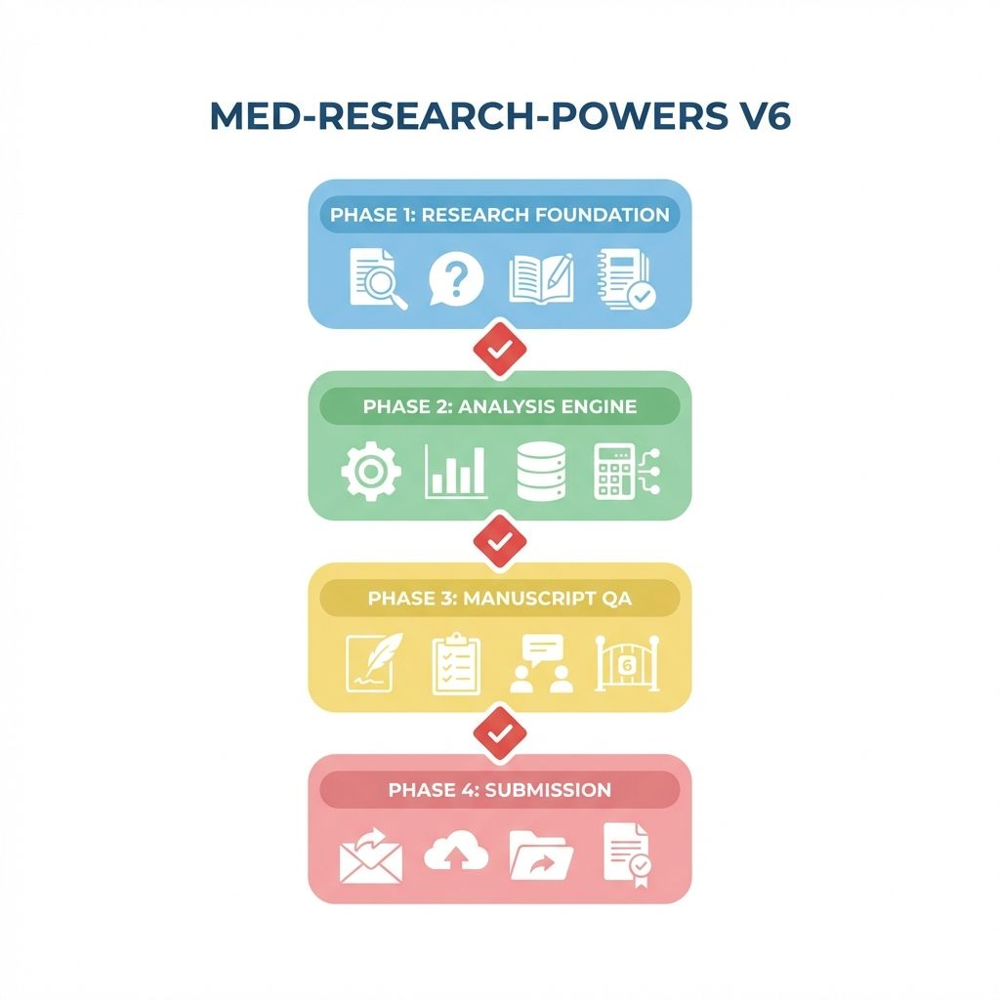

# Med-Research-Powers（医学科研方法论框架）

[English](README.md) | [中文](README_CN.md)

**从假设到发表 —— 一个有引导的科研方法论框架，在错误发生之前就把它拦下来。**

Med-Research-Powers（MRP）是一个 [Claude Code](https://claude.ai/code) 插件，把 AI 智能体变成严谨的科研助手。它不让 AI 跳过文献综述、滥用统计、忽视报告规范或编造参考文献，而是指导 Claude 沿着一条带 3 个必须确认节点的科研主线走：投稿前有 6 道关卡核验，还有 4 位审稿人模拟——让你交出去的每一篇稿件都经得起审查。

灵感来自 [Superpowers](https://github.com/obra/superpowers)（软件工程方法论），针对临床与生物医学研究做了改造。

> **版本 6.4.1** · 20 个 skill · 7 个斜杠命令 · MIT 许可 · 作者 BTCH Uro AI Lab

---

## 一览

| | |
|---|---|
| **Skills** | 20 个 skill，覆盖完整科研流程——每个 skill 都可以用 `/mrp:<skill 名>` 直接调用 |
| **斜杠命令** | 7 个命令，对应最常用的入口 |
| **研究类型** | 临床、基础/实验、AI/ML、定性、问卷/Delphi（统一入口路由） |
| **报告规范** | 47 项报告规范 —— CONSORT 2025、SPIRIT 2025、STROBE、PRISMA 2020、TRIPOD+AI 2024、DECIDE-AI、CLAIM 2024、IDEAL、ARRIVE 2.0、COREQ、CHERRIES、COSMIN …… |
| **期刊模板** | 240 本期刊，覆盖 30+ 专科 |
| **统计方法** | 15+ 类方法，配前提假设驱动的决策树 |
| **Python 脚本** | 10 个内置脚本（前提检验、样本量、数据体检、重跑核对、绘图样式、.docx 导出、期刊模板抽取、患者级划分、随机分组、流程状态） |
| **投稿前检查** | 6 道关卡，含 PubMed MCP 引用核验 |
| **同行评审** | 4 位审稿人模拟，0–100 量化评分，覆盖 8 个维度 |
| **必须确认的节点** | 3 个决策一定会等你明确同意：研究方案、分析计划、投稿前核验报告 |
| **导出** | Markdown → `.docx`（python-docx 脚本）；表格 `.xlsx` 用 `manuscript-writing` 里的 pandas/openpyxl 代码片段 |

---

## 为什么需要 MRP

AI 科研智能体每次都会犯同样的错。MRP 用有引导的流程取代"凭感觉"：

| 没有 MRP | 有 MRP |
|---|---|
| 直接开跑分析 | 先定义假设（PICO / FINER） |
| 挑一个"看起来对"的统计检验 | 决策树基于**已验证**的前提假设选方法 |
| 用 CONSORT 2010 | 用 CONSORT 2025（30 项，含子项共 42 行；已正式取代 2010） |
| 写完稿子就说"完成" | 投稿前先过 6 道关卡 |
| 自信地编造参考文献 | 每一条引用都对照 PubMed 核对（配置了 PubMed MCP 时自动核验，否则用 DOI / 网络检索人工核对） |
| 只报 `p < 0.05`，没有效应量 | 必须给效应量 + 95% CI + 精确 p 值 |
| 忽视报告规范 | 从 47 项报告规范里匹配研究类型对应的那一项 |
| AI 数据随机划分 | 患者级划分，提示数据泄漏与外部验证 |

**核心理念 —— 有引导的流程，而非建议：**

1. **先定义，再设计** —— PICO/FINER，没有假设不做分析。
2. **先计划，再执行** —— 任何检验前先有统计分析计划（SAP）。
3. **先核验，再投稿** —— 6 道投稿前关卡；CONSORT 2025 合规。
4. **先看数据，再定计划** —— 先给真实数据做体检，按体检结果写分析计划，再针对这份数据现写分析代码；内置脚本只做固定的事（数据体检、前提检验、样本量、绘图样式、导出）。

MRP 是提示词层面的引导：流水线、确认节点和关卡都是 Claude 遵循的指令，不是拦截工具调用的代码。它让跳步骤变得不容易、并且看得见——但不是绝对不可能。

---

## 快速开始

### 作为 Claude Code 插件安装（推荐）

在 Claude Code 中：

```
/plugin marketplace add Stefansong/med-research-powers
/plugin install mrp@med-research-powers
```

如果用本地克隆：

```bash
git clone https://github.com/Stefansong/med-research-powers
```

```
/plugin marketplace add ./med-research-powers
/plugin install mrp@med-research-powers
```

开发调试时可以不安装、直接加载：`claude --plugin-dir ./med-research-powers`

### 安装脚本（备选）

```bash
git clone https://github.com/Stefansong/med-research-powers
cd med-research-powers
./install.sh              # 交互式；或 ./install.sh --method 1|2
```

脚本提供两种方式：**1)** 上面的插件安装（有 `claude` 命令行时直接执行 `claude plugin marketplace add` + `claude plugin install`，否则打印这两条斜杠命令）；**2)** 把整个仓库软链到 `~/.claude/skills/med-research-powers`，Claude Code 会把它当作插件 `mrp@skills-dir` 加载——两种方式下 session hook 和 `${CLAUDE_PLUGIN_ROOT}` 都有效。脚本还会检查 `requirements.txt` 里的 Python 包。Windows 请用方式 1。

### 从 6.2.x 升级

插件名从 `med-research-powers` 改成了 `mrp`（所以命令是 `/mrp:…`）。先卸载旧名字，再按上面安装：

```
/plugin uninstall med-research-powers@med-research-powers
```

### 验证

```bash
claude plugin list        # 应该能看到 mrp@med-research-powers（或 mrp@skills-dir）
```

然后新开一个 Claude Code 会话，试试 `/mrp:research-question`——或者直接说 *"我想做一个 AI 辅助诊断的研究"*，MRP 会自动路由到对应 skill。

### 第一个项目

```
你：  "我想研究 AI 能不能提升 CT 上膀胱癌的检出"

MRP： research-question-formulation → PICO + 假设            （research-question.md）
      → literature-synthesis        → 证据图谱 + 研究空白
      → study-design（Type C：AI/ML）→ study-protocol.md       [确认节点 1：你批准]
      → research-ethics              → ethics-statement.md
      → journal-selection            → 暂定目标期刊
      → data-analysis-planning       → analysis-plan.md        [确认节点 2：你批准]
      → …… 后续主线，每步之后给一段简短摘要
```

---

## 研究主线（Pipeline）



```
research-question-formulation
→ literature-synthesis
→ study-design                      [确认节点 1：study-protocol.md]
→ research-ethics                   （伦理批准 / 注册必须在收集数据之前）
→ journal-selection                 （暂定目标期刊——软确认）
→ data-analysis-planning            [确认节点 2：analysis-plan.md]
→ data-collection-tools             （只在数据还没收集时）
→ [你收集数据]
→ statistical-analysis
→ figure-generation
→ manuscript-writing
→ peer-review-simulation
→ pre-submission-verification       [确认节点 3：submission-readiness-report.md —— 6 道关卡]
→ manuscript-export
→ submission-preparation
→ [投稿] → revision-response
```

- **`study-design`** 是统一入口路由，覆盖 Type A（临床）、B（基础/实验）、C（AI/ML）、D（定性）、E（问卷/Delphi）。五类都写同一个文件 `study-protocol.md`（文件里的 `type:` 字段区分）。
- **`research-ethics`** 在主线上：伦理批准和注册放在收集数据之前，而不是投稿时才查。
- **`peer-review-simulation`** 在 6 道关卡之前，**`manuscript-export`** 在关卡之后——关卡没过不必重新导出 `.docx`。
- 辅助 skill（`pubmed-search`、`reporting-standards`、`team-collaboration`、`using-med-research-powers`、`writing-mrp-skills`）由其他 skill 调用，或随时可用。

### 必须确认的节点

以下 3 个决策在真实研究中不可逆。Claude 会在每一处停下来等你明确同意——"没有回复"绝不视为同意：

| # | 节点 | 触发时机 | 你确认的内容 | 为何重要 |
|---|---|---|---|---|
| 1 | **`study-protocol.md`** | `study-design` 之后 | 研究类型、主要结局、对照 | 事后改主要结局 = outcome switching = 学术不端 |
| 2 | **`analysis-plan.md`（SAP）** | `data-analysis-planning` 之后 | 统计方法、分析策略 | 防 p-hacking 的记录；之后的每处偏离都要写下来 |
| 3 | **`submission-readiness-report.md`** | `pre-submission-verification` 之后 | 6 道关卡全部通过 | 通过之前不导出、不投稿 |

目标期刊是**软**确认：`journal-selection` 早期先给一个暂定期刊，随时可以换，写作前和投稿前各复核一次。

### 回溯

在下游发现问题（如投稿前检查时报告规范不合规），MRP 会回到上游 skill，修改后的产物再往前走时会重新验证。

---

## 20 个 Skill

Skill 根据自然语言意图自动触发——你无需记住名字；每个 skill 也都能用 `/mrp:<skill 名>` 直接调用。它们分为六层。

### 基础层（Foundation）

| # | Skill | 何时使用 | 输出 |
|---|-------|---------|------|
| 1 | **research-question-formulation** | 模糊想法需要明确的问题 + 假设（PICO/PIRD/FINER）。 | `research-question.md` |
| 2 | **literature-synthesis** | 系统检索与综述文献、寻找 research gap（PRISMA 流程）。 | `search-strategy.md`、`screening-log.md`、`literature-references.md`、`literature-synthesis-summary.md` |
| 3 | **study-design** | 根据真实条件（病例来源、预计事件数、资源）设计研究方案——临床/基础/AI-ML/定性/问卷（Type A–E 路由）。 | `study-protocol.md` |
| 4 | **research-ethics** | 收集数据前检查 IRB/IACUC、知情同意、隐私、注册、COI；起草伦理声明。 | `ethics-statement.md` |
| 5 | **journal-selection** | 选暂定目标期刊（评分匹配 + 三梯队级联策略）。 | `journal-selection-report.md` |

### 分析层（Analysis）

| # | Skill | 何时使用 | 输出 |
|---|-------|---------|------|
| 6 | **data-analysis-planning** | 先给真实数据做体检（只看结构和质量），再在任何检验**之前**定制 SAP。 | `analysis-plan.md`（+ `data-profile.md`） |
| 7 | **data-collection-tools** | 先分析数据真实来源（HIS/PACS/LIS 导出、谁在什么时候记录），再只生成研究需要的工具。 | `tools/` 目录（工具清单及理由、CRF/数据字典、脚本） |
| 8 | **statistical-analysis** | 按已批准的 SAP 针对这份数据现写清洗和分析代码，再自检（重跑、人数流、SAP 对照）。 | `results-summary.md` + `analysis-log.md`（另有 `analysis_script.py`/`.R`、`data-cleaning-log.md`） |
| 9 | **figure-generation** | 先按实际结果定图表计划，再按期刊样式出图（≥300 DPI、色盲友好）。 | `figure-plan.md` + TIFF/PDF 文件 |

### 稿件层（Manuscript）

| # | Skill | 何时使用 | 输出 |
|---|-------|---------|------|
| 10 | **manuscript-writing** | 先按项目实际产物列提纲，再撰写原始研究或综述（5 种综述类型）。 | `manuscript-outline.md` + `manuscript/` 目录 |
| 11 | **peer-review-simulation** | 过关卡之前模拟同行评审（4 审稿人 + 8 维度 0–100 评分）。 | `peer-review-simulation-report.md` |
| 12 | **pre-submission-verification** | 最终 6 道关卡检查——确认节点 3。 | `submission-readiness-report.md` |
| 13 | **manuscript-export** | 关卡通过后把 Markdown 导出为符合期刊排版的 `.docx`。 | `manuscript.docx` + `export-report.md` |
| 14 | **reporting-standards** | 把研究类型匹配到正确规范并检查合规（Gate 1 的内容）。 | 匹配清单 + 合规状态 |

### 投稿层（Submission）

| # | Skill | 何时使用 | 输出 |
|---|-------|---------|------|
| 15 | **submission-preparation** | 写投稿信 + 投稿系统指南（ScholarOne / Editorial Manager / eJournalPress / Snapp）。 | `cover-letter.md` |
| 16 | **revision-response** | 制定修稿策略 + 起草逐条回复信（rebuttal）。 | `revision-plan.md`、`revision-tracking.md`、`response-letter.md` |

### 工具层（Utility）

| # | Skill | 何时使用 | 输出 |
|---|-------|---------|------|
| 17 | **pubmed-search** | 用 PubMed MCP 检索、核验引用、批量取元数据。 | 检索结果、核验报告、格式化参考文献 |

### 元层（Meta）

| # | Skill | 何时使用 | 输出 |
|---|-------|---------|------|
| 18 | **team-collaboration** | 项目适合多 agent 并行（通过 Agent 工具派发子代理）。 | 协调的多 agent 输出 |
| 19 | **using-med-research-powers** | 编排器——路由、确认节点、流程状态、用户记忆。 | 路由 + 节点管理 + 会话恢复 |
| 20 | **writing-mrp-skills** | 创建、测试、改进 MRP skill。 | Skill 模板 |

---

## 7 个斜杠命令

命令是最常用入口的快捷方式。其余 skill 直接用 `/mrp:<skill 名>` 调用（例如 `/mrp:study-design`、`/mrp:journal-selection`、`/mrp:manuscript-export`）。

| 命令 | 作用 | 路由到 |
|------|------|--------|
| `/mrp:research-question` | 把模糊想法变成 PICO 问题 + 假设 | `research-question-formulation` |
| `/mrp:analyze-data` | 还没有 `analysis-plan.md` → 先写 SAP；SAP 已批准 → 执行分析 | `data-analysis-planning` → `statistical-analysis` |
| `/mrp:write-manuscript` | 撰写医学研究稿件（IMRaD 或综述） | `manuscript-writing` |
| `/mrp:peer-review` | 模拟同行评审（4 审稿人 + 8 维度评分） | `peer-review-simulation` |
| `/mrp:check-standards` | 只做报告规范检查（Gate 1 的内容） | `reporting-standards` |
| `/mrp:pre-submission` | 完整的 6 道投稿前关卡核验——确认节点 3 | `pre-submission-verification` |
| `/mrp:using-mrp` | 编排器——路由规则、流水线与确认节点 | `using-med-research-powers` |

命令只能由用户手动调用（`disable-model-invocation: true`），不会和 skill 重复触发。

---

## 确认方式

哪些事走流程：研究流程级的任务——选题、设计、分析、写作、投稿、修稿。单点小问题（改一句话、算一个数）直接回答，不走流程。

| 模式 | 怎么切换 | 行为 |
|------|---------|------|
| **轻量确认**（默认） | — | 每个 skill 完成后 Claude 给出 3–5 行摘要（产物、关键决策、待注意）然后继续；只在 3 个必须确认的节点等你 |
| **逐步确认** | 说"逐步确认" / "每步问我" | 每个 skill 之后都等你同意 |
| **一直做到底** | 说"一直做到底" / "不用问我" | 必须确认的节点只提示不等待；本该由你确认的内容仍然会写进产物 |

轻量摘要长这样：

```
[study-design] 已完成 → study-protocol.md（Type C，AI 诊断准确性）
关键决策：主要结局 = 外部测试集 AUROC；患者级划分
待注意：样本量按患病率 30% 估算——请用本院数据确认
确认节点 1 —— 请批准研究方案后我再继续。
```

随时说"回到 `<skill>`"就能回溯到那个 skill；修改后的产物会重新验证。

---

## 研究设计路由（Type A–E）

`study-design` 是单一入口，自动路由到对应方法学与报告规范：

| 类型 | 领域 | 示例 | 主要规范 |
|------|------|------|---------|
| **A** | 临床 | RCT、队列、横断面、交叉、非劣效、适应性、真实世界、注册研究 | CONSORT 2025 / SPIRIT 2025 / STROBE |
| **B** | 基础 / 实验 | 细胞、动物、分子（WB、qPCR、ELISA、流式、IF） | ARRIVE 2.0 |
| **C** | AI / ML | 影像、视频、LLM、器械 | TRIPOD+AI 2024 / DECIDE-AI / CLAIM 2024 / IDEAL |
| **D** | 定性 | 访谈、焦点小组、扎根理论、混合方法 | COREQ / SRQR |
| **E** | 问卷 / Delphi | 问卷、量表开发/验证、共识研究 | CHERRIES / CROSS / COSMIN |

多类型研究可叠加相应模块。AI/ML 模块要求患者级数据划分、4 档样本量策略、类别不平衡处理与决策曲线分析（DCA）。

`manuscript-writing` 同样支持原始研究**以及** 5 种综述：叙述性、系统、meta 分析、scoping、mini-review。

---

## 6 道投稿前核验

当你说"完成了"或"可以投了"，Claude 会运行 `pre-submission-verification`，并且在每道关卡都通过、你确认报告（确认节点 3）之前不进入导出和投稿信环节。任何失败都会路由回负责的 skill。

| 关卡 | 检查内容 | 未通过处理 |
|---|---|---|
| **1. 报告规范** | 根据研究类型匹配正确规范；逐项检查（CONSORT 2025：30 项，含子项共 42 行）。要求 0 个 Critical 错误。 | `reporting-standards` → 回 `manuscript-writing` 修改 |
| **2. 统计完整性** | 效应量 + 95% CI（不能只有 p 值）、精确 p 值、多重比较校正、敏感性分析、可复现脚本、SAP 偏离记录 | 返回 `statistical-analysis` |
| **3. 声明核验** | (A) 通过 `pubmed-search` 核验参考文献真实性——逐条查 PMID/DOI。(B) 数据一致性——摘要、结果、表格中的数字互相对应。(C) 声明-证据对齐。(D) 方法-结果匹配。(E) 预设分析 vs 探索性分析区分。(F) AI 幻觉模式。 | 修复参考文献 / 数据 |
| **4. 图表质量** | Arial/Helvetica 字体、最小 ≥6pt、≥300 DPI（线条图 ≥600）、坐标轴标签 + 单位、色盲友好配色、图注 | 返回 `figure-generation` |
| **5. 伦理与合规** | 方法中注明 IRB 批准号、知情同意声明、利益冲突披露、资助来源、数据可用性声明、临床试验注册（如适用） | 返回 `research-ethics` |
| **6. 形式要求** | 字数在期刊限制内、摘要字数、参考文献数量、短标题 ≤50 字符、3–6 个关键词、缩写首次出现时展开全称、作者信息完整 | 调整格式 |

Gate 3 的引用核验状态：✅ Verified · ⚠️ Not found（查询成功但无命中）· ❌ Mismatch（找到了但作者/年份/标题不符）· ⏳ Unverified（工具报错——请重试，这*不等于*文献不存在）· ℹ️ Non-PubMed（书籍、指南、arXiv——改用 DOI / 网络检索核对）。

---

## 4 位审稿人同行评审模拟

`peer-review-simulation` 模拟真实的编辑流程，包含 4 位独立审稿人、量化评分和期刊级别校准预测。它在 6 道关卡之前运行，并直接喂给 `revision-response`。

### 审稿人组成

| 审稿人 | 角色 | 关注重点 |
|---|---|---|
| **R1 —— 方法学家** | 研究设计专家 | 设计效度、统计方法、样本量、偏倚控制、可重复性 |
| **R2 —— 临床/领域专家** | 领域专家 | 临床意义、适用性、外部效度、替代解释 |
| **R3 —— 学术编辑** | 期刊把关人 | 结构、语言质量、图表标准、参考文献完整性、期刊适配度 |
| **R4 —— Devil's Advocate（魔鬼代言人）** | 对抗性审稿人 | 挑战最强结论、发现盲点、提出最坏情况解读 |

魔鬼代言人不是搞破坏——它帮你提前准备好真实审稿人会问的最刁钻问题。

### 8 维度评分（0–100）

| 维度 | 权重 | 刻度 |
|---|---|---|
| 原创性 | 15% | 0–30 重复性 / 31–60 增量性 / 61–80 有意义 / 81–100 突破性 |
| 方法学 | 20% | 0–30 有缺陷 / 31–60 可改进 / 61–80 合理 / 81–100 创新 |
| 结果 | 15% | 0–30 不可靠 / 31–60 部分可靠 / 61–80 扎实 / 81–100 有说服力 |
| 临床影响 | 15% | 0–30 无 / 31–60 有限 / 61–80 有意义 / 81–100 改变临床实践 |
| 写作质量 | 10% | 0–30 不清晰 / 31–60 需润色 / 61–80 清晰 / 81–100 优雅 |
| 图表 | 10% | 0–30 不达标 / 31–60 可接受 / 61–80 专业 / 81–100 出版级 |
| 参考文献 | 5% | 0–30 不充分 / 31–60 基本 / 61–80 全面 / 81–100 权威 |
| 可重复性 | 10% | 0–30 不可重复 / 31–60 部分可重复 / 61–80 可重复 / 81–100 完全透明 |

### 编辑总结与决策

编辑总结不是简单的平均分——它遵循真实编辑行为：任何 **Critical** 问题都会把决定降为大修，无论分数多高；≥2 位审稿人建议拒稿就是拒稿。然后按目标期刊的层级校准分数（层级定义见 [`scoring-rubric.yaml`](skills/peer-review-simulation/references/scoring-rubric.yaml)）。

| 校准后分数 | 预测结果 |
|---|---|
| 80–100 | 接收 / 小修 |
| 65–79 | 小修 |
| 50–64 | 大修 |
| 30–49 | 大修（风险高） |
| 0–29 | 拒稿 |

4 位审稿人作为独立子代理并行运行（Claude Code 的 Agent 工具，旧名 Task），然后由主代理生成编辑总结。问题按严重度（Critical / Major / Minor / Suggestion）标记。

---

## 多数据库文献检索

`literature-synthesis` 同时检索多个数据库，以 PubMed MCP 作为主要检索引擎。

### PubMed MCP 功能

7 个函数名固定；工具前缀是 `mcp__<server 名>__<函数>`，`<server 名>` 以你当前会话的工具列表为准（claude.ai 连接器是 `claude_ai_PubMed`，本地常见是 `PubMed`）：

| 功能 | 用途 |
|---|---|
| `search_articles` | 关键词 / MeSH / 布尔检索——返回 `pmids`、`total_count`、`query_translation` |
| `get_article_metadata` | 获取完整元数据（作者、摘要、DOI、MeSH 词），用于筛选 |
| `get_full_text_article` | 访问 PMC 全文（`pmc_ids=[...]`），用于详细筛选和数据提取 |
| `find_related_articles` | 从种子 PMID 出发找相似文献（`pmids=[...]`） |
| `convert_article_ids` | PMID / PMCID / DOI 相互转换（`ids=[...]`，`id_type="pmid"|"doi"|"pmcid"`） |
| `lookup_article_by_citation` | 有引用信息但没有 PMID 时的反向查找 |
| `get_copyright_status` | 检查开放获取状态和再使用许可 |

### 按研究类型选择数据库

| 研究类型 | 主要数据库 | 补充数据库 |
|---|---|---|
| 临床 / 生物医学 | PubMed | Cochrane, Embase |
| AI/ML 医学 | PubMed + arXiv | IEEE Xplore, ACM DL |
| 系统综述 | PubMed + Cochrane + Embase | Web of Science |
| 基础 / 分子 | PubMed | bioRxiv, medRxiv |
| 手术视频 / 器械 | PubMed + IEEE | Scopus |

### 输出文件（4 个）

| 文件 | 内容 |
|---|---|
| `search-strategy.md` | 完整的可复现检索策略（按数据库） |
| `screening-log.md` | PRISMA 流程图数据，含每个阶段的计数 |
| `literature-references.md` | 每篇纳入研究的结构化记录 |
| `literature-synthesis-summary.md` | 证据图谱：已知 / 未知 / 有争议 + 研究空白 |

---

## 统计方法覆盖范围

**先分析，再计划，再决定，再执行——不用现成的分析脚本。**真实临床数据的编码、伪装缺失（"/"、"未查"、999）、截断检验值（"<0.1"）、同一患者多条记录、事件数各不相同，所以 MRP 不会拿一个通用脚本去套：

- **分析**：`data-analysis-planning` 先用只读的 `data_profile.py` 给真实数据做体检（只看结构和质量——变量、编码、缺失、事件总数、聚类结构；**绝不**看变量与结局的关系）；前瞻性研究则分析 protocol 和 CRF。
- **计划**：你在确认节点 2 批准的 SAP 第 1 节就是"数据现状与由此做出的选择"（例如事件数决定能放几个预测变量、同一患者多个结石要用 GEE/混合模型）。方法用[决策树](skills/data-analysis-planning/references/stat-method-decision-tree.yaml)加 10 张[方法要点卡](skills/data-analysis-planning/references/method-cards/README.md)来选——每张写明必做步骤、常见坑、核实过的 R/Python 包和必报内容。
- **执行**：`statistical-analysis` 先对照 SAP 再体检一次数据，然后**针对这份数据**用你习惯的语言（R 或 Python）现写清洗和分析代码，每段注明对应 SAP 的第几条。
- **自检**：用 `reproduce_check.py` 从头重跑、结果必须一致；每一步人数连得上、能直接画流程图；SAP → 代码 → 结果逐条对照；所有偏离写进 `analysis-log.md`。

决策树覆盖 15+ 类方法：

| 类别 | 方法 |
|---|---|
| **两组比较** | 独立/配对 t 检验、Welch's t 检验、Mann-Whitney U、Wilcoxon 符号秩检验、卡方检验、Fisher 精确检验 |
| **多组比较** | 单因素 ANOVA + Tukey、Welch's ANOVA + Games-Howell、Kruskal-Wallis + Dunn's、Friedman + Nemenyi、重复测量 ANOVA |
| **相关 / 回归** | Pearson、Spearman、线性回归、Logistic 回归、Poisson / 负二项回归 |
| **生存分析** | Log-rank、Kaplan-Meier、Cox 比例风险模型、竞争风险（Fine-Gray）、AFT 模型、时变协变量 |
| **纵向 / 混合模型** | 线性混合模型（LMM）、广义估计方程（GEE）、重复测量 ANOVA |
| **因果推断** | 倾向评分（匹配、IPTW、分层）、工具变量（2SLS）、双重差分 |
| **中介分析** | Baron-Kenny、因果中介（自然直接/间接效应）、Bootstrap 置信区间 |
| **缺失数据** | MCAR 检验（Little's test）、多重插补（MICE, m≥20）、MNAR 敏感性分析、临界点分析 |
| **聚类数据** | ICC 计算、设计效应、随机截距/斜率模型、聚类稳健 GEE |
| **交互 / 亚组** | 交互项、森林图、预设 vs 探索性标注 |
| **高维 / 组学** | PCA、UMAP/t-SNE、DESeq2、edgeR、limma、FDR 校正、批次效应去除（ComBat） |
| **间断时间序列** | 分段回归、ARIMA、对照 ITS |
| **诊断与 AI/ML 评估** | AUROC/AUPRC、DeLong、校准、决策曲线分析（DCA）、自助 CI |
| **多重比较** | Bonferroni、Holm、Benjamini-Hochberg FDR |
| **假设检验** | Shapiro-Wilk、D'Agostino-Pearson、Levene's、Mauchly 球形检验、Schoenfeld 残差 |

---

## 报告规范（47）

完整的机读索引见 [`skills/reporting-standards/references/checklists/standards-index.yaml`](skills/reporting-standards/references/checklists/standards-index.yaml)。**47 项规范中有 21 项附带从原文逐条转写的 checklist YAML**（CONSORT 2025、CONSORT-AI、SPIRIT 2025、SPIRIT-AI、TIDieR、TREND、RECORD、STROBE、PRISMA 2020、PRISMA-ScR、STARD 2015、TRIPOD 2015、TRIPOD+AI、CLAIM 2024、DECIDE-AI、ARRIVE 2.0、CHERRIES、CROSS、CARE、SQUIRE 2.0、CHEERS 2022）；其余只给官方来源，并明确要求 Claude 不得编造条目。

### 按研究类型分类

| 类别 | 标准 |
|---|---|
| **临床试验** | CONSORT 2025（30 项，含子项共 42 行）、CONSORT-AI、CONSORT-Cluster、CONSORT 非劣效扩展、TREND（非随机试验）、SPIRIT 2025（34 条目，只用于 protocol）、SPIRIT-AI、TIDieR、CONSORT-Harms |
| **观察性研究** | STROBE（22 条目）、RECORD、STROCSS 2024（外科队列 / 病例对照） |
| **系统综述** | PRISMA 2020（27 条目）、PRISMA-P、PRISMA-ScR、PRISMA-S、PRISMA-DTA、PRISMA-NMA、TRIPOD-SRMA（2023）、AMSTAR 2、GRADE |
| **指南评估** | AGREE II（2010；6 个领域 23 条目 + 2 项总体评价） |
| **观察性研究 Meta 分析** | MOOSE（35 条目） |
| **诊断准确性** | STARD 2015（30 条目） |
| **AI 与预测** | TRIPOD 2015（22 项，旧版）、TRIPOD+AI 2024（27 条目）、TRIPOD-LLM（2025）、TRIPOD-Cluster（2023，19 条目）、CLAIM 2024（44 条目；取代 CLAIM 2020）、MI-CLAIM、DECIDE-AI（17 条 AI 专属 + 10 条通用）、PROBAST |
| **外科与器械** | IDEAL 框架（Pre-IDEAL / 第 0 阶段 + 5 阶段） |
| **定性研究** | COREQ（32 条目）、SRQR（21 条目） |
| **问卷与量表** | CHERRIES（网络问卷）、CROSS（横断面调查）、COSMIN 2.0（2025；测量工具） |
| **临床前研究** | ARRIVE 2.0（21 条目） |
| **其他** | CARE（病例报告）、SQUIRE（质量改进）、CHEERS（卫生经济学） |
| **偏倚评估工具** | Cochrane RoB 2、ROBINS-I、Newcastle-Ottawa 量表（满分 9）、MINORS、QUADAS-2 |

> **CONSORT 2010 已正式被取代** —— MRP 始终路由到 CONSORT 2025（30 项，含子项共 42 行）。[Hopewell et al., BMJ 2025; doi:10.1136/bmj-2024-081123]

---

## 期刊模板（240）

**240 本期刊、覆盖 30+ 专科**的排版要求（字数限制、摘要格式、参考文献风格、章节结构、特殊栏目、投稿信与 ORCID 要求、投稿系统）见 [`skills/manuscript-writing/references/journal-templates.yaml`](skills/manuscript-writing/references/journal-templates.yaml)。各 skill 用 `get_journal_template.py` 按 id 抽取单条模板，不整读文件。

| 专科 | 期刊 |
|---|---|
| **综合顶刊** | Nature, Nature Medicine, Lancet, NEJM, JAMA, BMJ, Annals of Internal Medicine |
| **综合中等** | BMC Medicine, Medicine |
| **肿瘤学** | JCO, Lancet Oncology, JAMA Oncology, Annals of Oncology, Cancer Research |
| **外科学** | Annals of Surgery, JAMA Surgery, BJS, Surgical Endoscopy |
| **泌尿外科** | European Urology, Journal of Urology, BJU International |
| **心脏病学** | European Heart Journal, JACC, Circulation |
| **消化内科** | Gastroenterology, Gut, Hepatology |
| **呼吸内科** | Lancet Respiratory, AJRCCM, CHEST |
| **神经内科** | Lancet Neurology, Neurology, JAMA Neurology |
| **放射与影像** | Radiology, European Radiology, Medical Image Analysis |
| **AI / 数字健康** | npj Digital Medicine, Lancet Digital Health, JMIR, IEEE JBHI |
| **儿科** | Lancet Child, JAMA Pediatrics, Pediatrics |
| **骨科** | JBJS, CORR |
| **眼科** | Ophthalmology, JAMA Ophthalmology |
| **皮肤科** | JAMA Dermatology, BJD |
| **病理科** | Modern Pathology, AJSP |
| **感染病学** | Lancet ID, CID |
| **内分泌学** | Diabetes Care, Lancet Diabetes |
| **肾脏病学** | JASN |
| **精神科** | Lancet Psychiatry, JAMA Psychiatry |
| **系统综述** | Cochrane Database, Systematic Reviews |
| **开放获取** | PLOS Medicine, PLOS ONE, Nature Communications, Scientific Reports |
| **中国 SCI** | Chinese Medical Journal, Science Bulletin, Signal Transduction, eClinicalMedicine |

每个模板包含：字数限制、摘要格式（结构化/非结构化）、参考文献格式及上限、图表限制、章节结构、特殊要求（Key Points 框、Research in Context 面板、Reporting Summary）、投稿系统和 ORCID 政策。期刊家族规则（Lancet / JAMA / Nature 子刊）只保存在这个文件里。

库里的影响因子和 APC 都带数据年份：42 本常投期刊（泌尿、影像、AI/数字健康、顶级综合与肿瘤刊）有 `IF_year`/`IF_source` 字段，是出版社官网公布的 JCR 2025 或 2024 值；其余仍是 JCR 2022 值（规则见 `data_as_of`）。各 skill 引用时会标年份并建议先上网复核。若某期刊未收录，MRP 会通过网络检索其"Instructions for Authors"。

---

## 内置 Python 脚本

脚本里只放工具和护栏：容易算错且错了看不出来的公式（样本量）、防止研究作废的检查（患者级划分泄漏、随机分组）、基础设施（状态、期刊查询、导出）、只报告的检查工具。**分析代码本身由 Claude 针对每份数据现写。**各 skill 通过 `${CLAUDE_PLUGIN_ROOT}` 调用这些脚本——这是 Claude Code 设置的插件安装目录。

| 脚本 | 位置 | 用途 |
|------|------|------|
| `assumption_tests.py` | `statistical-analysis/scripts/` | 前提诊断（Shapiro-Wilk / D'Agostino-Pearson、Levene）只作描述，不用来切换检验；给出按设计的默认方法（Welch）和 SAP 预先规定时才用的秩检验备选；Cohen's d 含 CI |
| `power_analysis.py` | `statistical-analysis/scripts/` | 跨设计的样本量/效能：两组、两组率（合并方差 Fleiss 公式，可选连续性校正）、诊断准确性、生存、相关——含脱落率调整 |
| `data_profile.py` | `statistical-analysis/scripts/` | 只读数据体检（CSV/XLSX，兼容 GBK）：伪装缺失、"<0.1" 这类截断值、数值存成文本、日期解析失败、重复患者 ID、结局事件总数（同一患者多行时按患者计）、测量值被误判为 ID 时可用 `--not-id`、疑似隐私字段（按列名、身份证/手机号样式或"每名患者一个取值"识别，只报列名不显示取值）——不改数据，不计算任何与结局的关系 |
| `reproduce_check.py` | `statistical-analysis/scripts/` | 在全新进程里把分析命令跑两次并逐个比较输出（表格逐单元格、xlsx 公式、SVG/.gz 按内容、屏幕输出）——退出码 0 一致 / 1 不一致 / 2 运行失败；中断时放回原有输出；`--exclude`、`--keep-last` |
| `pub_style.py` | `figure-generation/scripts/` | 期刊图表样式（Nature、Lancet、JAMA、NEJM 配色）、色盲友好选项、按期刊栏宽精确导出（RGB TIFF + PDF，≥300 DPI）、显著性标注（含对数轴） |
| `export_docx.py` | `manuscript-export/scripts/` | 由期刊模板库驱动，Markdown → 符合期刊排版的 `.docx`（段落、1–6 级标题、嵌套列表、带对齐的表格、代码块、强调、链接）；生成 `export-report.md`（字数、占位符、未转换的引用键） |
| `get_journal_template.py` | `manuscript-writing/scripts/` | 从 240 本期刊的 YAML 里按 id 抽取单条模板（不整读文件） |
| `patient_level_split.py` | `data-collection-tools/scripts/` | 患者级训练 / 验证 / 测试集划分（集合之间不泄漏） |
| `randomization.py` | `data-collection-tools/scripts/` | RCT 的区组 / 分层随机分组表 |
| `mrp_state.py` | `using-med-research-powers/scripts/` | 每个主线 skill 结束时读取和更新 `.mrp-state.json` |

使用示例：

```python
import os, sys
sys.path.insert(0, os.path.join(os.environ.get("CLAUDE_PLUGIN_ROOT", "."), "skills", "statistical-analysis", "scripts"))
sys.path.insert(0, os.path.join(os.environ.get("CLAUDE_PLUGIN_ROOT", "."), "skills", "figure-generation", "scripts"))

from assumption_tests import full_check          # 前提检验
result = full_check(group1, group2, paired=False)
print(f"Recommended test: {result['recommended_test']}")  # 只作描述；用哪个检验以 SAP 为准（默认 Welch）

# 数据体检和重跑核对是命令行工具：
#   python3 "$CLAUDE_PLUGIN_ROOT/skills/statistical-analysis/scripts/data_profile.py" data.xlsx --id patient_id --outcome recurrence --report data-profile.md
#   python3 "$CLAUDE_PLUGIN_ROOT/skills/statistical-analysis/scripts/reproduce_check.py" --cmd "Rscript analysis.R" --outputs results/

from power_analysis import two_groups            # 样本量计算
result = two_groups(effect_size=0.5, power=0.80, dropout=0.15)

from pub_style import apply_style                # 出版图表样式
apply_style('lancet')
```

依赖安装：`pip install -r requirements.txt`。

---

## 多智能体并行协作

MRP 使用 Claude Code 的子代理工具（**Agent**，旧名 Task）并行化独立的科研任务，由主代理协调结果（`team-collaboration`）。

### 自动并行（无需确认）

| 触发条件 | 并行任务 |
|---|---|
| 文献综述涉及 ≥2 个数据库 | 每个数据库一个子代理，同步检索 |
| 同行评审模拟 | 4 个子代理作为独立审稿人，并行评估 |

### 需用户确认的并行

| 触发条件 | 并行任务 |
|---|---|
| 修回涉及多个独立的审稿意见 | 每位审稿人的反馈分配一个子代理，各写各的文件，主代理合并 |
| 方案设计需要多专家审查 | 统计学 + 方法学 + AI 专家子代理 |

### 合并规则

- 子代理输出在合并前会检查数值一致性。
- 子代理绝不同时写同一个稿件文件；主代理串行合并并裁决冲突。
- 如果某个子代理发现需要另一个子代理的数据，并行中止并切换为顺序执行。

---

## 用户记忆

MRP 把少量偏好记在一个全局文件里：`~/.claude/mrp-user-profile.json`（按人、不按项目）。启动时不会问一堆问题：字段是"用到才采集"——某个 skill 第一次需要某字段而它又不存在时，Claude 只问那一个问题，并问你要不要保存。

| Skill | 读取的字段 | 用途 |
|-------|-----------|------|
| `journal-selection` | `preferences.favorite_journals` | 优先推荐你以前投过的期刊 |
| `data-analysis-planning` | `preferences.preferred_stats_tool` | 用你习惯的语言（Python / R / SPSS / Stata）生成脚本 |
| `figure-generation` | `preferences.preferred_figure_style` | 套用你偏好的图表风格（nature / lancet / jama / nejm） |

### 隐私

- 只存在本地 —— 不会上传到任何服务。
- 随时删除 `~/.claude/mrp-user-profile.json` 即可清空，或者说"忘记我的 [某项]"。
- MRP 绝不记录密码、患者数据或伦理批准号。

---

## 会话状态

MRP 用项目目录里的 `.mrp-state.json` 记录研究进度，新会话可以接着上次做。每个主线 skill 结束时用 `mrp_state.py` 更新它；session-start hook 只读取其中几个短字段，并报告 *"上次完成：[阶段]。下一步：[skill]。继续吗？"*（hook 具体读哪些字段见 [SECURITY.md](SECURITY.md)）。

```json
{
  "project": "AI-assisted bladder-cancer detection on CT",
  "current_stage": "data-analysis-planning",
  "completed_skills": [
    {"skill": "research-question-formulation", "date": "2026-09-01", "outputs": ["research-question.md"]},
    {"skill": "study-design", "date": "2026-09-05", "outputs": ["study-protocol.md"]}
  ],
  "artifacts": {
    "research-question.md": {"version": 1},
    "study-protocol.md": {"version": 2, "change_log": "Primary outcome clarified after checkpoint 1"}
  },
  "target_journal": "European Urology",
  "checkpoint_mode": "light",
  "next_step": "data-analysis-planning"
}
```

字段：`project`、`current_stage`、`completed_skills[{skill, date, outputs[]}]`、`artifacts{}`、`target_journal`、`checkpoint_mode`（`"light"` | `"step"` | `"auto"`）、`next_step`。Schema 见 [`skills/using-med-research-powers/references/state-schemas.md`](skills/using-med-research-powers/references/state-schemas.md)。这个文件只存于本地项目目录，绝不上传。

---

## .docx 导出

大多数期刊要求以 Word 格式提交。6 道关卡通过后，`manuscript-export` 生成投稿文件：

| 文件 | 由谁生成 | 说明 |
|------|---------|------|
| `manuscript.docx` | `export_docx.py` | 符合期刊排版的主文件（字体、行距、章节顺序和特殊栏目来自期刊模板） |
| `export-report.md` | `export_docx.py` | 字数（正文 / 摘要 / 参考文献分开统计）、参考文献与图数量、残留占位符 |
| `figures/*.tiff` | `figure-generation`（`pub_style.py`） | 图片文件，≥300 DPI（线条图 ≥600） |
| 表格 `.xlsx` | `manuscript-writing` 里的 pandas / openpyxl 代码片段 | 不是内置脚本——期刊要求表格单独上传时运行该片段 |

标题页和补充材料由 `manuscript-writing` 以 Markdown 起草；期刊要求单独文件时用同一个脚本转换。

---

## 架构对比：Superpowers vs MRP

MRP 将 Superpowers 方法学框架从软件工程适配到医学研究。

| Superpowers（软件工程） | Med-Research-Powers（医学研究） | 适配原因 |
|---|---|---|
| `brainstorming` | `research-question-formulation` | 结构化 PICO/FINER 替代自由发散 |
| `writing-plans` | `study-design`（Type A–E 路由） | 单一设计 skill，跨研究领域路由 |
| `test-driven-development` | `data-analysis-planning` | SAP = 测试计划；反 p-hacking = 反回归 |
| `executing-plans` | `statistical-analysis` | 可复现脚本 = 可复现构建 |
| `requesting-code-review` | `peer-review-simulation` | 4 位审稿人替代代码审查者 |
| `verification-before-completion` | `pre-submission-verification` | 6 道关卡系统替代 CI/CD 检查 |
| `receiving-code-review` | `revision-response` | 逐条回复 = 代码审查回复 |
| `finishing-a-development-branch` | `journal-selection` + `submission-preparation` | 期刊定位 + 投稿信替代合并/部署 |
| `writing-skills` | `writing-mrp-skills` | 相同的元技能，保证可扩展性 |
| — | `literature-synthesis` | 软件工程中无对应物；研究需要证据综述 |
| — | `reporting-standards` | 软件工程中无对应物；47 项领域特定合规规范 |
| — | `research-ethics` | 软件工程中无对应物；IRB/IACUC 要求 |

---

## 环境要求

- **Claude Code**（CLI、桌面端、网页端或 IDE 扩展）。
- **Python 3** 及 [`requirements.txt`](requirements.txt) 里的包（`scipy`、`statsmodels`、`matplotlib`、`pandas`、`numpy`、`python-docx`、`openpyxl`、`pyyaml`），供内置脚本使用——skill 本身不依赖它们。
- **PubMed MCP**（可选但推荐）：任何提供上述 7 个函数（`search_articles`、`get_article_metadata`、`find_related_articles`、`lookup_article_by_citation`、`convert_article_ids`、`get_full_text_article`、`get_copyright_status`）的 MCP server。工具写法为 `mcp__<server 名>__<函数>`，server 名以你当前会话的工具列表为准（claude.ai 连接器为 `claude_ai_PubMed`，本地常见为 `PubMed`）。配置了它，引用会自动核验；没有配置，就退化为 DOI / 网络检索的人工核对。

---

## 仓库结构

```
med-research-powers/
├── .claude-plugin/        plugin.json（name: mrp）、marketplace.json
├── .github/               ci.yml（守卫、pytest、shellcheck、plugin validate、hook 冒烟）、evals.yml（手动）、issue/PR 模板
├── commands/              7 个斜杠命令（薄路由 → skill）
├── skills/                20 个 skill，每个含：SKILL.md + references/ + scripts/
├── hooks/                 session-start.sh（读取 .mrp-state.json，报告恢复点）
├── docs/                  architecture.md、USER-MANUAL.md、images/
├── tools/                 check_consistency.py —— 仓库守卫（版本、计数、路径、链接）
├── tests/                 内置脚本的 pytest 测试
├── evals/                 `claude plugin eval` 用例 —— skill 路由回归（见 evals/README.md）
├── examples/              一个合成的示例项目（状态文件、研究问题、Type C protocol）
├── install.sh             安装脚本（插件 / 软链接）
├── requirements.txt       内置脚本的 Python 依赖
├── README.md / README_CN.md
└── CHANGELOG.md · CONTRIBUTING.md · SECURITY.md · LICENSE
```

每个 skill 把推理逻辑留在 `SKILL.md`，把查表、模板、清单放进 `references/`，把可复用代码放进 `scripts/`——既保持上下文精简，又便于维护。

---

## 卸载

```
/plugin uninstall mrp@med-research-powers
```

也可以顺手删掉 marketplace：`/plugin marketplace remove med-research-powers`。如果用的是软链接方式：`rm ~/.claude/skills/med-research-powers`。MRP 在项目里生成的文件（`.mrp-state.json`、各种产物）和全局的 `~/.claude/mrp-user-profile.json` 都归你，留着或删掉都行。

---

## 贡献

见 [CONTRIBUTING.md](CONTRIBUTING.md)。新 skill 遵循 `writing-mrp-skills` 规范：仅触发条件的 `description`（≤200 字符，以 "Use when" 开头）、标准章节集合（Overview、When to Use、When NOT to Use、Workflow、Output、Common Mistakes、Convergence、Red Flags、衔接规则）、查阅型内容放 `references/`、固定代码放 `scripts/`、SKILL.md ≤ 500 行。提 PR 前运行 `python tools/check_consistency.py` 和 `pytest tests/`。

**贡献方式：**

- **新 skill** —— 阅读 `skills/writing-mrp-skills/SKILL.md`，在 `skills/` 中创建 skill，然后提交 PR。
- **专科包** —— 为你的专科提供期刊配置、MeSH 词表、评估工具。
- **报告规范** —— 在 `skills/reporting-standards/references/checklists/` 中添加或更新清单。
- **期刊模板** —— 按现有格式向 `journal-templates.yaml` 添加条目。
- **Bug 报告** —— 提交 issue，说明哪些 skill 应该触发但没有触发、清单条目不正确或脚本错误。安全问题见 [SECURITY.md](SECURITY.md)。

---

## 许可与致谢

- **许可：** MIT（见 [LICENSE](LICENSE)）
- **作者：** BTCH Uro AI Lab
- **灵感来源：** [Superpowers](https://github.com/obra/superpowers)（作者 Jesse Vincent）—— 启发本项目的软件工程方法论框架

### 致谢

- [Superpowers](https://github.com/obra/superpowers)，作者 Jesse Vincent —— 启发 MRP 的方法论框架
- [EQUATOR Network](https://www.equator-network.org/) —— 报告规范的权威来源
- 基于 NCBI E-utilities 的各类 PubMed MCP server（社区实现与 claude.ai 连接器）—— 让自动引用核验成为可能；MRP 本身不内置 server

*Med-Research-Powers 引导方法论，但不替代你的判断、你的伦理委员会或你的统计师。请始终确认伦理状态，并请合格专家复核分析。*
