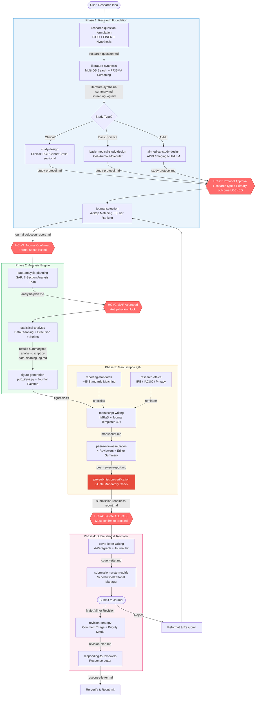
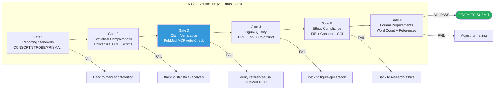
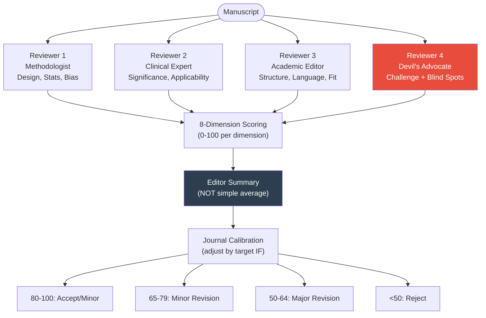
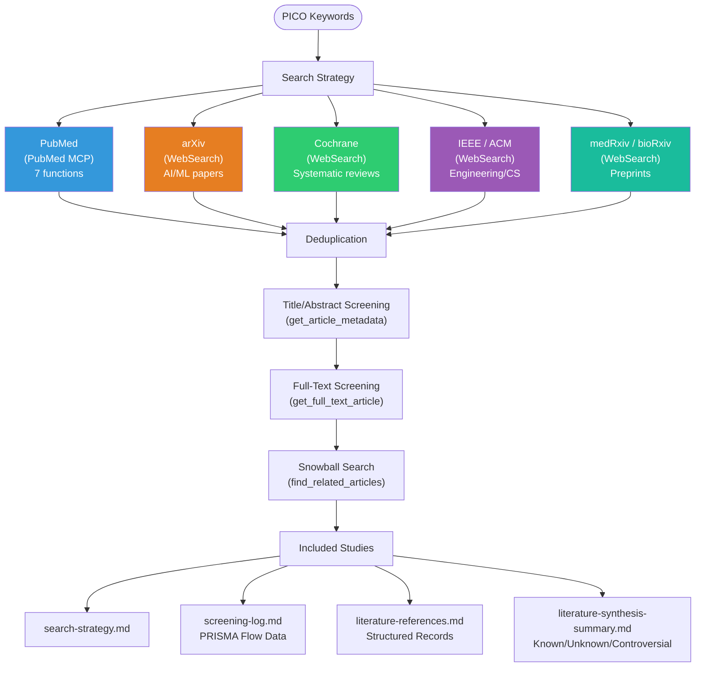
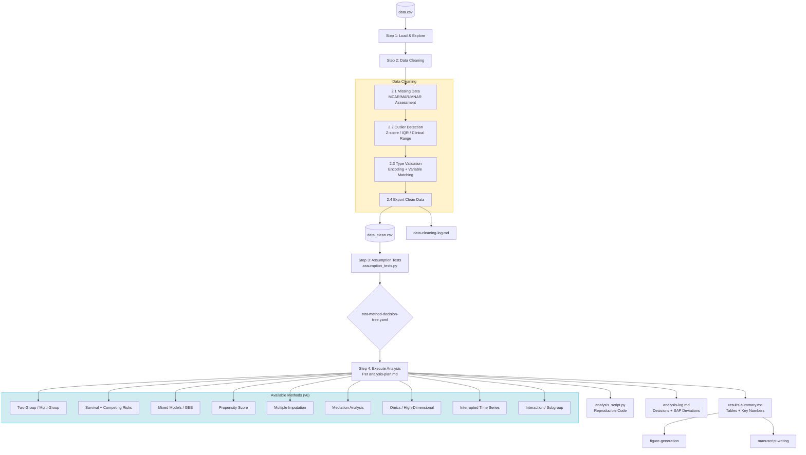
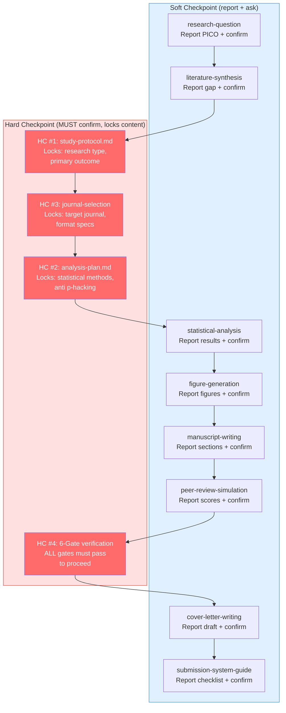
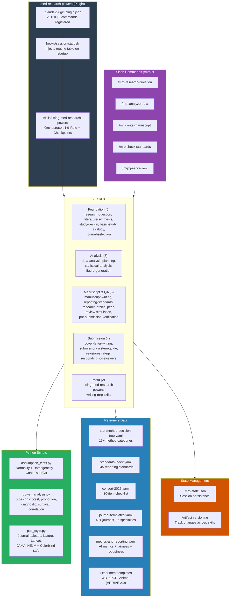
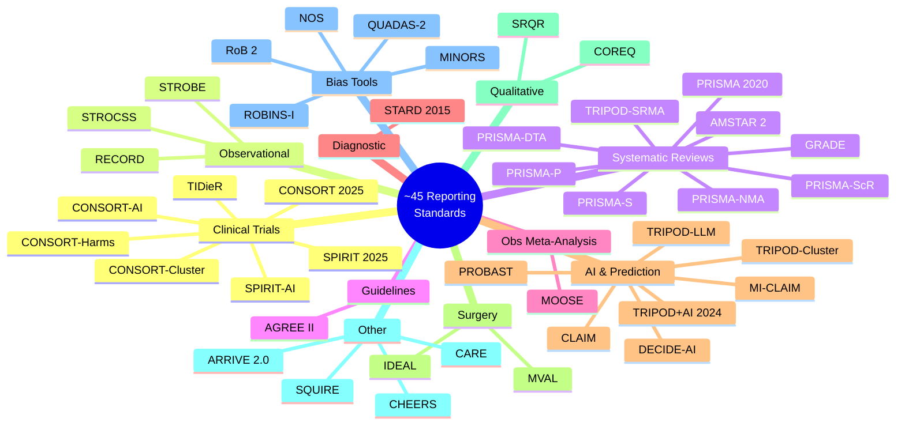

# Med-Research-Powers v6.0.0 Architecture

## 1. Full Pipeline Flow

## 2. 6-Gate Pre-Submission Verification

## 3. Peer Review Simulation

## 4. Literature Synthesis: Multi-Database Search

## 5. Statistical Analysis Data Flow

## 6. Checkpoint Protocol

## 7. Plugin Architecture

## 8. Reporting Standards Coverage Map

