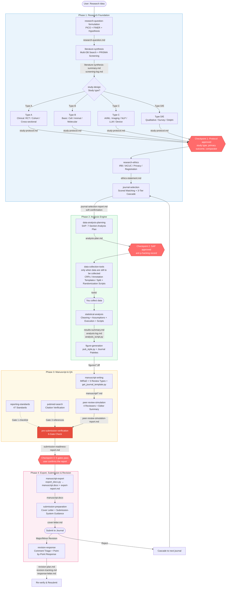
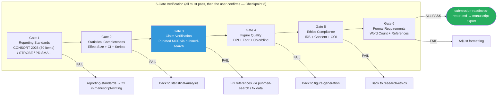
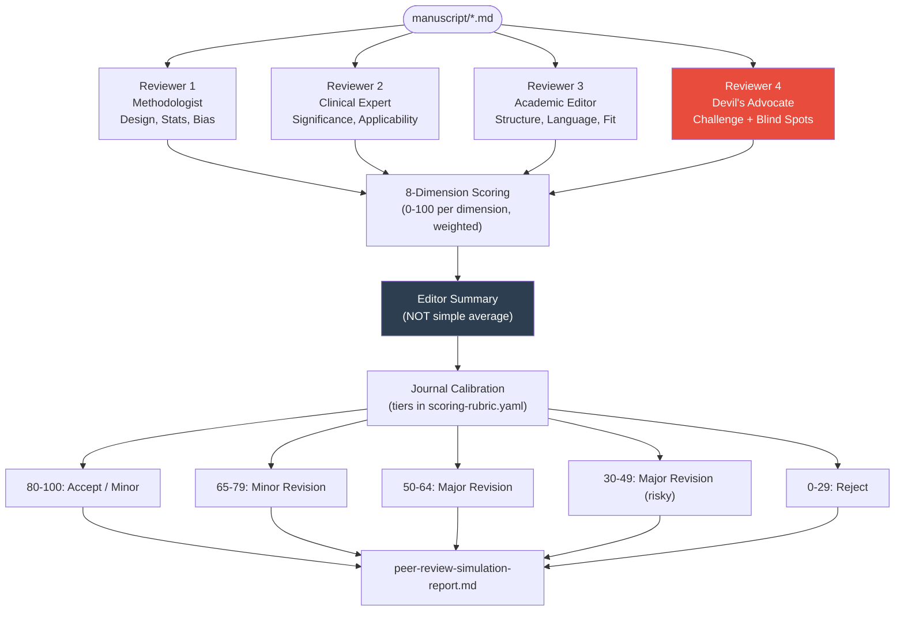
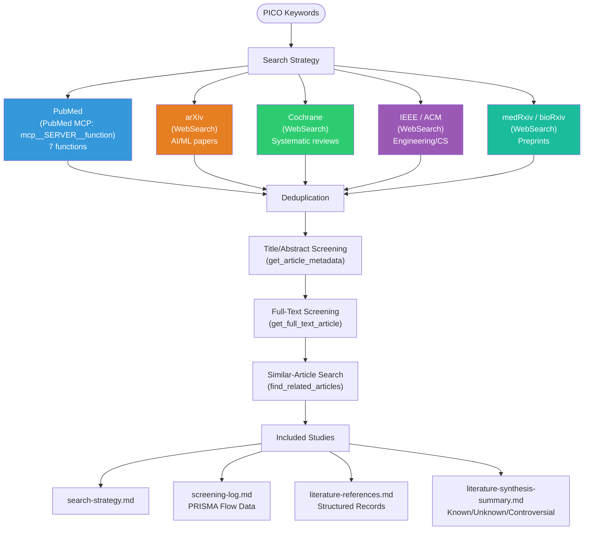
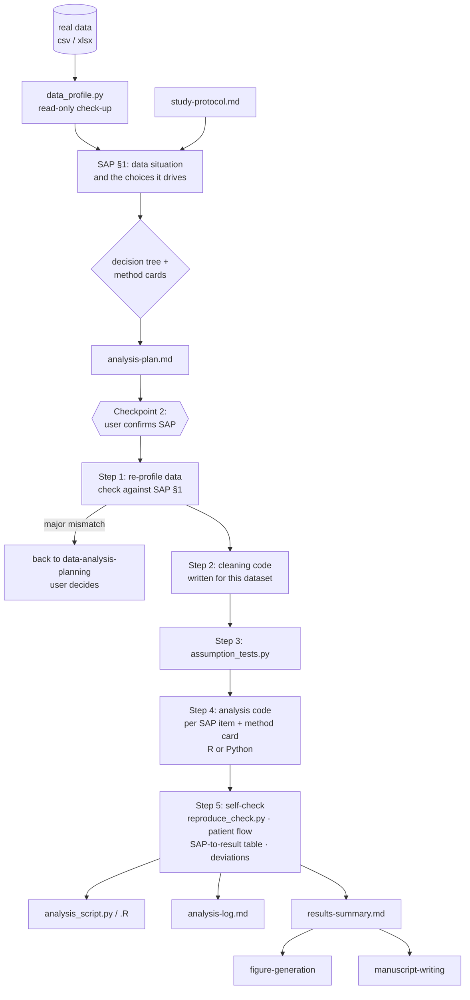
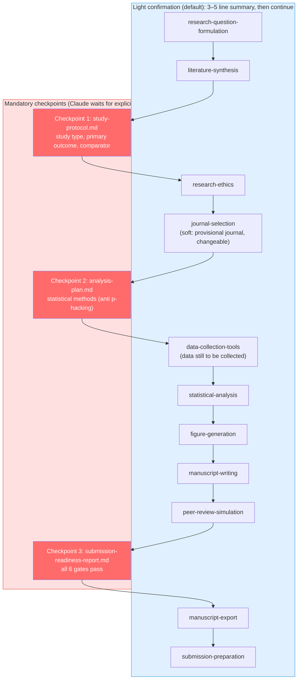
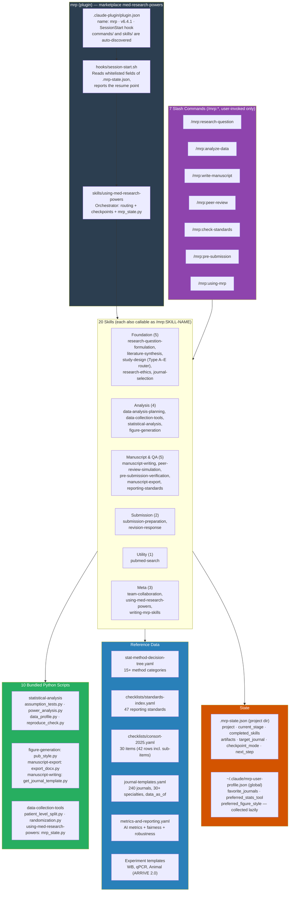
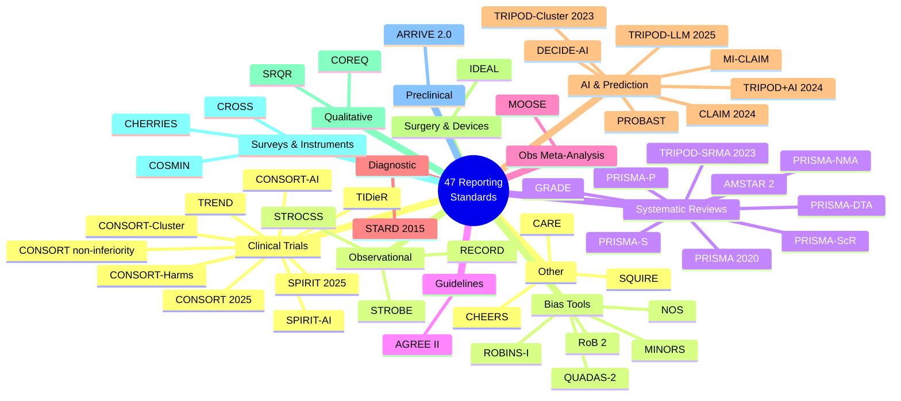

# Med-Research-Powers v6.4.1 Architecture

## 1. Full Pipeline Flow

```mermaid
flowchart TD
    START([User: Research Idea]) --> RQ

    subgraph PHASE1["Phase 1: Research Foundation"]
        RQ[research-question-formulation<br/>PICO + FINER + Hypothesis]
        LS[literature-synthesis<br/>Multi-DB Search + PRISMA Screening]
        SD{study-design<br/>Study type?}
        SD_A[Type A<br/>Clinical: RCT / Cohort / Cross-sectional]
        SD_B[Type B<br/>Basic: Cell / Animal / Molecular]
        SD_C[Type C<br/>AI/ML: Imaging / NLP / LLM / Device]
        SD_DE[Type D/E<br/>Qualitative / Survey / Delphi]
        RE[research-ethics<br/>IRB / IACUC / Privacy / Registration]
        JS[journal-selection<br/>Scored Matching + 3-Tier Cascade]
    end

    subgraph PHASE2["Phase 2: Analysis Engine"]
        DAP[data-analysis-planning<br/>SAP: 7-Section Analysis Plan]
        DCT[data-collection-tools<br/>only when data are still to be collected<br/>CRFs / Annotation Templates / Split + Randomization Scripts]
        COLLECT([You collect data])
        SA[statistical-analysis<br/>Cleaning + Assumptions + Execution + Scripts]
        FG[figure-generation<br/>pub_style.py + Journal Palettes]
    end

    subgraph PHASE3["Phase 3: Manuscript & QA"]
        MW[manuscript-writing<br/>IMRaD + 5 Review Types + get_journal_template.py]
        PRS[peer-review-simulation<br/>4 Reviewers + Editor Summary]
        PSV[pre-submission-verification<br/>6-Gate Check]
        RS[reporting-standards<br/>47 Standards]
        PS[pubmed-search<br/>Citation Verification]
    end

    subgraph PHASE4["Phase 4: Export, Submission & Revision"]
        ME[manuscript-export<br/>export_docx.py → manuscript.docx + export-report.md]
        SP[submission-preparation<br/>Cover Letter + Submission-System Guidance]
        SUB([Submit to Journal])
        RVR[revision-response<br/>Comment Triage + Point-by-Point Response]
    end

    RQ -->|research-question.md| LS
    LS -->|literature-synthesis-summary.md<br/>screening-log.md| SD
    SD -->|Type A| SD_A
    SD -->|Type B| SD_B
    SD -->|Type C| SD_C
    SD -->|Type D/E| SD_DE
    SD_A -->|study-protocol.md| HC1
    SD_B -->|study-protocol.md| HC1
    SD_C -->|study-protocol.md| HC1
    SD_DE -->|study-protocol.md| HC1

    HC1{{"Checkpoint 1: Protocol approved<br/>study type, primary outcome, comparator"}}
    HC1 --> RE
    RE -->|ethics-statement.md| JS
    JS -->|journal-selection-report.md<br/>soft confirmation| DAP
    DAP -->|analysis-plan.md| HC2
    HC2{{"Checkpoint 2: SAP approved<br/>anti p-hacking record"}}
    HC2 --> DCT
    DCT -->|tools/| COLLECT
    COLLECT --> SA
    SA -->|results-summary.md<br/>analysis-log.md<br/>analysis_script.py| FG
    FG -->|figures/*.tiff| MW

    RS -.->|Gate 1 checklist| PSV
    PS -.->|Gate 3 references| PSV

    MW -->|manuscript/*.md| PRS
    PRS -->|peer-review-simulation-report.md| PSV
    PSV -->|submission-readiness-report.md| HC3
    HC3{{"Checkpoint 3: 6 gates pass<br/>user confirms the report"}}
    HC3 --> ME
    ME -->|manuscript.docx| SP
    SP -->|cover-letter.md| SUB
    SUB -->|Major/Minor Revision| RVR
    RVR -->|revision-plan.md<br/>revision-tracking.md<br/>response-letter.md| PSV2[Re-verify & Resubmit]

    SUB -->|Reject| RESUBMIT[Cascade to next journal]
    RESUBMIT --> JS

    style HC1 fill:#ff6b6b,stroke:#c0392b,color:#fff
    style HC2 fill:#ff6b6b,stroke:#c0392b,color:#fff
    style HC3 fill:#ff6b6b,stroke:#c0392b,color:#fff
    style PSV fill:#e74c3c,stroke:#c0392b,color:#fff
    style PHASE1 fill:#eaf4fc,stroke:#3498db
    style PHASE2 fill:#eafcef,stroke:#27ae60
    style PHASE3 fill:#fef9e7,stroke:#f39c12
    style PHASE4 fill:#fdeef4,stroke:#e91e63
```

Auxiliary skills not on the main line: `pubmed-search` (called by literature-synthesis, manuscript-writing and Gate 3), `reporting-standards` (Gate 1 content, also `/mrp:check-standards`), `team-collaboration`, `using-med-research-powers` (orchestrator), `writing-mrp-skills`.

## 2. 6-Gate Pre-Submission Verification

```mermaid
flowchart LR
    subgraph GATE["6-Gate Verification (all must pass, then the user confirms — Checkpoint 3)"]
        G1["Gate 1<br/>Reporting Standards<br/>CONSORT 2025 (30 items) / STROBE / PRISMA..."]
        G2[Gate 2<br/>Statistical Completeness<br/>Effect Size + CI + Scripts]
        G3[Gate 3<br/>Claim Verification<br/>PubMed MCP via pubmed-search]
        G4[Gate 4<br/>Figure Quality<br/>DPI + Font + Colorblind]
        G5[Gate 5<br/>Ethics Compliance<br/>IRB + Consent + COI]
        G6[Gate 6<br/>Formal Requirements<br/>Word Count + References]
    end

    G1 --> G2 --> G3 --> G4 --> G5 --> G6
    G6 -->|ALL PASS| READY([submission-readiness-report.md → manuscript-export])
    G1 -->|FAIL| FIX1[reporting-standards → fix in manuscript-writing]
    G2 -->|FAIL| FIX2[Back to statistical-analysis]
    G3 -->|FAIL| FIX3[Fix references via pubmed-search / fix data]
    G4 -->|FAIL| FIX4[Back to figure-generation]
    G5 -->|FAIL| FIX5[Back to research-ethics]
    G6 -->|FAIL| FIX6[Adjust formatting]

    style READY fill:#27ae60,color:#fff
    style G3 fill:#3498db,color:#fff
```

Gate 3 citation statuses: ✅ Verified · ⚠️ Not found · ❌ Mismatch · ⏳ Unverified (tool error — retry) · ℹ️ Non-PubMed (DOI / web check).

## 3. Peer Review Simulation

```mermaid
flowchart TD
    MS([manuscript/*.md]) --> R1 & R2 & R3 & R4

    R1["Reviewer 1<br/>Methodologist<br/>Design, Stats, Bias"]
    R2["Reviewer 2<br/>Clinical Expert<br/>Significance, Applicability"]
    R3["Reviewer 3<br/>Academic Editor<br/>Structure, Language, Fit"]
    R4["Reviewer 4<br/>Devil's Advocate<br/>Challenge + Blind Spots"]

    R1 & R2 & R3 & R4 --> SCORE["8-Dimension Scoring<br/>(0-100 per dimension, weighted)"]
    SCORE --> ES["Editor Summary<br/>(NOT simple average)"]
    ES --> CAL["Journal Calibration<br/>(tiers in scoring-rubric.yaml)"]

    CAL --> D1["80-100: Accept / Minor"]
    CAL --> D2["65-79: Minor Revision"]
    CAL --> D3["50-64: Major Revision"]
    CAL --> D4["30-49: Major Revision (risky)"]
    CAL --> D5["0-29: Reject"]

    D1 & D2 & D3 & D4 & D5 --> OUT[peer-review-simulation-report.md]

    style R4 fill:#e74c3c,color:#fff
    style ES fill:#2c3e50,color:#fff
```

The four reviewers run as parallel sub-agents (Claude Code's Agent tool, formerly Task); the main agent writes the Editor Summary.

## 4. Literature Synthesis: Multi-Database Search

```mermaid
flowchart TD
    PICO([PICO Keywords]) --> STRATEGY[Search Strategy]

    STRATEGY --> DB1 & DB2 & DB3 & DB4 & DB5

    DB1["PubMed<br/>(PubMed MCP: mcp__SERVER__function)<br/>7 functions"]
    DB2["arXiv<br/>(WebSearch)<br/>AI/ML papers"]
    DB3["Cochrane<br/>(WebSearch)<br/>Systematic reviews"]
    DB4["IEEE / ACM<br/>(WebSearch)<br/>Engineering/CS"]
    DB5["medRxiv / bioRxiv<br/>(WebSearch)<br/>Preprints"]

    DB1 & DB2 & DB3 & DB4 & DB5 --> DEDUP[Deduplication]
    DEDUP --> SCREEN1["Title/Abstract Screening<br/>(get_article_metadata)"]
    SCREEN1 --> SCREEN2["Full-Text Screening<br/>(get_full_text_article)"]
    SCREEN2 --> SNOW["Similar-Article Search<br/>(find_related_articles)"]
    SNOW --> INCLUDED[Included Studies]

    INCLUDED --> OUT1[search-strategy.md]
    INCLUDED --> OUT2[screening-log.md<br/>PRISMA Flow Data]
    INCLUDED --> OUT3[literature-references.md<br/>Structured Records]
    INCLUDED --> OUT4[literature-synthesis-summary.md<br/>Known/Unknown/Controversial]

    style DB1 fill:#3498db,color:#fff
    style DB2 fill:#e67e22,color:#fff
    style DB3 fill:#2ecc71,color:#fff
    style DB4 fill:#9b59b6,color:#fff
    style DB5 fill:#1abc9c,color:#fff
```

## 5. Statistical Analysis Data Flow

Analyse → plan → decide → execute. Planning may look at the data's **structure and quality** only; associations with the outcome are computed only after the SAP is confirmed. Cleaning and analysis code is written for each dataset — there is no analysis template.

```mermaid
flowchart TD
    DATA[(real data<br/>csv / xlsx)] --> PROF1[data_profile.py<br/>read-only check-up]
    PROF1 --> SITU[SAP §1: data situation<br/>and the choices it drives]
    PROTO[study-protocol.md] --> SITU
    SITU --> PICK{decision tree +<br/>method cards}
    PICK --> SAP[analysis-plan.md]
    SAP --> HC2{{Checkpoint 2:<br/>user confirms SAP}}
    HC2 --> PROF2[Step 1: re-profile data<br/>check against SAP §1]
    PROF2 -->|major mismatch| BACK[back to data-analysis-planning<br/>user decides]
    PROF2 --> CLEAN[Step 2: cleaning code<br/>written for this dataset]
    CLEAN --> ASSUME[Step 3: assumption_tests.py]
    ASSUME --> EXEC[Step 4: analysis code<br/>per SAP item + method card<br/>R or Python]
    EXEC --> CHECK[Step 5: self-check<br/>reproduce_check.py · patient flow<br/>SAP-to-result table · deviations]
    CHECK --> OUT1[analysis_script.py / .R]
    CHECK --> OUT2[analysis-log.md]
    CHECK --> OUT3[results-summary.md]
    OUT3 --> FIG[figure-generation]
    OUT3 --> MANUSCRIPT[manuscript-writing]
```

## 6. Checkpoint Protocol

```mermaid
flowchart TD
    subgraph LIGHT["Light confirmation (default): 3–5 line summary, then continue"]
        S1["research-question-formulation"]
        S2["literature-synthesis"]
        S3["research-ethics"]
        S4["journal-selection<br/>(soft: provisional journal, changeable)"]
        S5["data-collection-tools<br/>(data still to be collected)"]
        S6["statistical-analysis"]
        S7["figure-generation"]
        S8["manuscript-writing"]
        S9["peer-review-simulation"]
        S10["manuscript-export"]
        S11["submission-preparation"]
    end

    subgraph HARD["Mandatory checkpoints (Claude waits for explicit approval)"]
        H1["Checkpoint 1: study-protocol.md<br/>study type, primary outcome, comparator"]
        H2["Checkpoint 2: analysis-plan.md<br/>statistical methods (anti p-hacking)"]
        H3["Checkpoint 3: submission-readiness-report.md<br/>all 6 gates pass"]
    end

    S1 --> S2 --> H1
    H1 --> S3 --> S4 --> H2
    H2 --> S5 --> S6 --> S7 --> S8 --> S9 --> H3
    H3 --> S10 --> S11

    style HARD fill:#ffe0e0,stroke:#e74c3c
    style LIGHT fill:#e0f0ff,stroke:#3498db
    style H1 fill:#ff6b6b,color:#fff
    style H2 fill:#ff6b6b,color:#fff
    style H3 fill:#ff6b6b,color:#fff
```

Modes (`checkpoint_mode` in `.mrp-state.json`): **light** (default, above) · **step** — "ask me at every step": waits after every skill · **auto** — "run it all the way": checkpoints are announced but not waited for, and the content that would have been confirmed is written into the artifact. Research-workflow tasks enter the pipeline; one-off questions are answered directly.

## 7. Plugin Architecture

```mermaid
flowchart TD
    subgraph PLUGIN["mrp (plugin) — marketplace med-research-powers"]
        PJ[".claude-plugin/plugin.json<br/>name: mrp · v6.4.1 · SessionStart hook<br/>commands/ and skills/ are auto-discovered"]
        HOOK["hooks/session-start.sh<br/>Reads whitelisted fields of .mrp-state.json,<br/>reports the resume point"]
        META["skills/using-med-research-powers<br/>Orchestrator: routing + checkpoints + mrp_state.py"]
    end

    subgraph COMMANDS["7 Slash Commands (/mrp:*, user-invoked only)"]
        CMD1["/mrp:research-question"]
        CMD2["/mrp:analyze-data"]
        CMD3["/mrp:write-manuscript"]
        CMD4["/mrp:peer-review"]
        CMD5["/mrp:check-standards"]
        CMD6["/mrp:pre-submission"]
        CMD7["/mrp:using-mrp"]
    end

    subgraph SKILLS["20 Skills (each also callable as /mrp:SKILL-NAME)"]
        SK_F["Foundation (5)<br/>research-question-formulation,<br/>literature-synthesis,<br/>study-design (Type A–E router),<br/>research-ethics, journal-selection"]
        SK_A["Analysis (4)<br/>data-analysis-planning, data-collection-tools,<br/>statistical-analysis,<br/>figure-generation"]
        SK_M["Manuscript & QA (5)<br/>manuscript-writing, peer-review-simulation,<br/>pre-submission-verification,<br/>manuscript-export, reporting-standards"]
        SK_S["Submission (2)<br/>submission-preparation,<br/>revision-response"]
        SK_U["Utility (1)<br/>pubmed-search"]
        SK_X["Meta (3)<br/>team-collaboration,<br/>using-med-research-powers,<br/>writing-mrp-skills"]
    end

    subgraph SCRIPTS["10 Bundled Python Scripts"]
        PY1["statistical-analysis<br/>assumption_tests.py · power_analysis.py<br/>data_profile.py · reproduce_check.py"]
        PY2["figure-generation: pub_style.py<br/>manuscript-export: export_docx.py<br/>manuscript-writing: get_journal_template.py"]
        PY3["data-collection-tools<br/>patient_level_split.py · randomization.py<br/>using-med-research-powers: mrp_state.py"]
    end

    subgraph REFS["Reference Data"]
        R1["stat-method-decision-tree.yaml<br/>15+ method categories"]
        R2["checklists/standards-index.yaml<br/>47 reporting standards"]
        R3["checklists/consort-2025.yaml<br/>30 items (42 rows incl. sub-items)"]
        R4["journal-templates.yaml<br/>240 journals, 30+ specialties, data_as_of"]
        R5["metrics-and-reporting.yaml<br/>AI metrics + fairness + robustness"]
        R6["Experiment templates<br/>WB, qPCR, Animal (ARRIVE 2.0)"]
    end

    subgraph STATE["State"]
        ST1[".mrp-state.json (project dir)<br/>project · current_stage · completed_skills<br/>artifacts · target_journal · checkpoint_mode · next_step"]
        ST2["~/.claude/mrp-user-profile.json (global)<br/>favorite_journals · preferred_stats_tool<br/>preferred_figure_style — collected lazily"]
    end

    PJ --> HOOK
    HOOK --> META
    META --> SKILLS
    COMMANDS --> SKILLS
    SKILLS --> SCRIPTS
    SKILLS --> REFS
    SKILLS --> STATE

    style PLUGIN fill:#2c3e50,color:#fff
    style COMMANDS fill:#8e44ad,color:#fff
    style SCRIPTS fill:#27ae60,color:#fff
    style REFS fill:#2980b9,color:#fff
    style STATE fill:#d35400,color:#fff
```

Quality gates in CI (`.github/workflows/ci.yml`): `tools/check_consistency.py` (versions, counts, script paths, SKILL.md frontmatter, links, README/README_CN sync), `pytest tests/`, `sh -n` + shellcheck on the hook and installer, `claude plugin validate --strict`, and a hook smoke test.

## 8. Reporting Standards Coverage Map

```mermaid
mindmap
  root(("47 Reporting<br/>Standards"))
    Clinical Trials
      CONSORT 2025
      CONSORT-AI
      CONSORT-Cluster
      CONSORT non-inferiority
      TREND
      SPIRIT 2025
      SPIRIT-AI
      TIDieR
      CONSORT-Harms
    Observational
      STROBE
      RECORD
      STROCSS
    Systematic Reviews
      PRISMA 2020
      PRISMA-P
      PRISMA-ScR
      PRISMA-S
      PRISMA-DTA
      PRISMA-NMA
      TRIPOD-SRMA 2023
      AMSTAR 2
      GRADE
    Guidelines
      AGREE II
    Obs Meta-Analysis
      MOOSE
    Diagnostic
      STARD 2015
    AI & Prediction
      TRIPOD+AI 2024
      TRIPOD-LLM 2025
      TRIPOD-Cluster 2023
      CLAIM 2024
      MI-CLAIM
      DECIDE-AI
      PROBAST
    Surgery & Devices
      IDEAL
    Qualitative
      COREQ
      SRQR
    Surveys & Instruments
      CHERRIES
      CROSS
      COSMIN
    Preclinical
      ARRIVE 2.0
    Other
      CARE
      SQUIRE
      CHEERS
    Bias Tools
      RoB 2
      ROBINS-I
      NOS
      MINORS
      QUADAS-2
```
